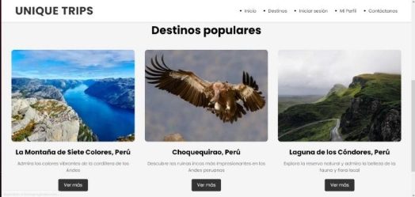
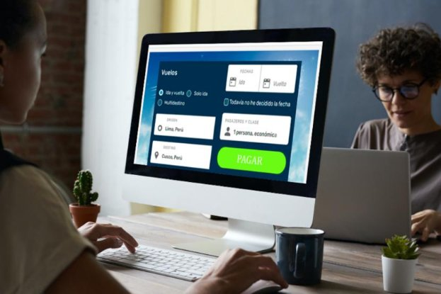

Agosto – 2023

Agosto – 2023

![ref1]![ref1]
**Universidad Peruana de Ciencias Aplicadas    UPC**   

**Ingeniería de Sistemas y Computación | Ingeniería de Ciencias de la Computación**  

**Curso:** Aplicaciones Web

**Profesor:** Naldo Reupo Musayon Gastulo

**Sección:** WX53

**TB1**

**UNIQUE TRIPS** 

Team Members

Maguiña Corzo, Ricardo Jesus                             U202121858

Onofre Ruiz, Carlos Jesus                   		U202115590	

Ponce Loyola, Jorge Sebastian                            	U202120471

Arana Ramos, Jack		                          U202121875

Regalado Morales Alyne Nayely 	            U20201A976 

Agosto – 2023

   	  	            	
#
#
# Registro de Versiones del Informe

|Versión|Fecha|Autor|Entrega|
| - | - | - | - |
|1°|3/09/23|Ricardo Maguiña|
TB1

|
|2°||
Ricardo Maguiña

|
TP

|
|3°||
Ricardo Maguiña

|
TB3

|
|4°||
Ricardo Maguiña

|
TF

|

# Contenido
[Registro de Versiones del Informe	2](#_toc144562035)

[**Student Outcome**	6](#_toc144562036)

[**Capítulo I: Introducción**                                	9](#_toc144562037)

[**1.1. Startup Profile**	9](#_toc144562038)

[1.1.1. Descripción de la Startup	9](#_toc144562039)

[1.1.2. Perfiles de integrantes del equipo	10](#_toc144562040)

[**1.2. Solution Profile**	12](#_toc144562041)

[1.2.1. Antecedentes y Problemática	13](#_toc144562042)

[1.2.2. Lean UX Process	15](#_toc144562043)

[**1.3. Segmento Objetivo**	23](#_toc144562044)

[1.3.1. Datos estadísticos para el análisis	23](#_toc144562045)

[1.3.2 Características demográficas obtenidas en el análisis	25](#_toc144562046)

[**Capítulo II**	26](#_toc144562047)

[**2.1. Competidores**	26](#_toc144562048)

[2.1.1. Análisis competitivo	26](#_toc144562049)

[2.1.2. Estrategias y tácticas frente a competidores	30](#_toc144562050)

[**2.2. Entrevistas**	31](#_toc144562051)

[2.2.1. Diseño de entrevistas	31](#_toc144562052)

[2.2.2. Registro de entrevistas.	31](#_toc144562053)

[2.2.3.Análisis de entrevistas.	35](#_toc144562055)

[**2.3. Needfinding**	39](#_toc144562056)

[2.3.1. User Personas	40](#_toc144562057)

[2.3.2. User Task Matrix	41](#_toc144562058)

[2.3.4. Empathy Mapping.	43](#_toc144562059)

[2.3.5. As-is Scenario Mapping	45](#_toc144562060)

[**Capítulo III**	47](#_toc144562061)

[**3.1. To Be Scenario Mapping**	47](#_toc144562062)

[**3.2. User Stories**	48](#_toc144562063)

[**3.3. Impact Mapping**	58](#_toc144562064)

[**3.4. Product Backlog**	59](#_toc144562065)

[**Capítulo IV**	61](#_toc144562066)

[**4.1. Style Guidelines**	61](#_toc144562067)

[4.1.1. General Style Guidelines	62](#_toc144562068)

[4.1.2. Web Style Guide	64](#_toc144562069)

[4.1.3. Mobile Style Guide	65](#_toc144562070)

[**4.2. Information Architecture**	66](#_toc144562071)

[4.2.1. Organization Systems	66](#_toc144562072)

[4.2.2. Labeling Systems	67](#_toc144562073)

[4.2.3. SEO Tags and Meta Tags	68](#_toc144562074)

[4.2.4. Searching Systems	69](#_toc144562076)

[4.2.5. Navigation Systems	70](#_toc144562077)

[**4.3. Landing Page UI Design**	71](#_toc144562078)

[4.3.1. Landing Page Wireframes	71](#_toc144562079)

[4.3.2. Landing Page Mock-Up	75](#_toc144562080)

[**4.4. Web Applications UX/UI Design**	78](#_toc144562081)

[4.4.1. Web Applications Wireframes	78](#_toc144562082)

[4.4.2. Web Applications Wireflow Diagrams	83](#_toc144562083)

[4.4.3. Web Applications Mock-ups	86](#_toc144562084)

[4.4.4. Web Applications User Flow Diagrams	88](#_toc144562085)

[**4.5. Web Applications Prototyping**	89](#_toc144562086)

[**4.6. Domain-Driven Software Architecture**	89](#_toc144562087)

[4.6.1. Software Architecture Context Diagram	89](#_toc144562088)

[4.6.2. Software Architecture Container Diagrams	90](#_toc144562089)

[4.6.3. Software Architecture Components Diagrams	91](#_toc144562090)

[**4.7. Software Object-Oriented Design**	93](#_toc144562091)

[4.7.1. Class Diagrams	93](#_toc144562092)

[4.7.2. Class Dictionary	94](#_toc144562093)

[**4.8. Database Design**	95](#_toc144562094)

[4.8.1. Database Diagram	95](#_toc144562095)

[**Capitulo V**	96](#_toc144562096)

[**5.1. Software Configuration Management**	96](#_toc144562097)

[5.1.1. Software Development Environment Configuration	96](#_toc144562098)

[5.1.1.1. Project Management	96](#_toc144562099)

[5.1.1.2. Requirements Managements	96](#_toc144562103)

[5.1.1.3. Product UX/UI Design	96](#_toc144562106)

[5.1.1.4. Software Development	96](#_toc144562109)

[5.1.1.5. Software Testing	97](#_toc144562110)

[5.1.1.6. Software Deployment	97](#_toc144562111)

[5.1.2. Source Code Management	97](#_toc144562112)

[5.1.3. Source Code Style Guide & Conventions	98](#_toc144562113)

[5.1.4. Software Deployment Configuration	99](#_toc144562114)

[**5.2. Landing Page, Services & Applications Implementation**	100](#_toc144562115)

[5.2.1. Sprint 1	100](#_toc144562116)

[5.2.2. Sprint 2	103](#_toc144562117)

[**5.3. Validation Interviews**	111](#_toc144562118)

[5.3.1. Diseño de Entrevistas	111](#_toc144562119)

[5.3.2. Registro de Entrevistas	111](#_toc144562120)

[5.3.3. Evaluaciones según heurísticas	111](#_toc144562121)

[**5.4. Video About-the-Product**	111](#_toc144562122)

[**Conclusiones**	111](#_toc144562123)

[**Bibliografía**	112](#_toc144562124)

[**Anexos**	113](#_toc144562125)

**                                                                                                                      
**

**Student Outcome**   

|**Criterio específico** |**Acciones realizadas** |**Conclusiones** |
| :-: | :-: | :-: |
|
Participa en equipos multidisciplinarios con eficacia, eficiencia y objetividad, en el marco de un proyecto en soluciones de ingeniería de software.

|
**TB1**                                                           

***Ponce Loyola, Jorge Sebastian*** 

Durante la TB1, contribuí eficazmente al equipo multidisciplinario en un proyecto de ingeniería de software, enfocándome en la Information Architecture. Participé en la organización, etiquetado, SEO, navegación y sistemas de búsqueda para mejorar la experiencia del usuario en aplicaciones web y móviles.

                         

***Arana Ramos, Jack***

Durante la TB1, mi enfoque se centró en la arquitectura de software, el diseño orientado a objetos y la estructura de la base de datos. Estas actividades fueron cruciales para garantizar la solidez y la eficiencia de nuestro proyecto de ingeniería de software.

***Onofre Ruiz, Carlos Jesus***

Durante la TB1, mi enfoque es demostrar la eficiencia al momento de hacer uso de plataforma que nos permitan trabajar en equipo y poder controlar las versiones con ayuda de Github, haciendo uso de los repositorios. Sabemos que Github tiene la opcion de mostrar el avance de cada integrante de esta manera visualizamos que todos lleguen a completar las competetencias de manera exitosa.

                        

***Maguiña Corzo , Ricardo Jesus***

***Regalado Morales Alyne Nayely*** 

Durante la TB1, desempeñé un papel de investigación de información y el análisis de la problemática. Mi enfoque principal se centró en detallar la startup, identificar sus antecedentes y desafíos, comprender el proceso de Lean UX y definir nuestro público objetivo. Considero que la recopilación de información fue una etapa crucial, y a partir de ese punto, avanzamos hacia la creación de historias de usuario para seguir con la elaboración del prototipo de la aplicación web.

                 
|

|
|Conoce al menos un sector empresarial o dominio de aplicación de soluciones de software.|
**TB1**

***Ponce Loyola, Jorge Sebastian*** 

Durante la TB1, he adquirido un profundo conocimiento del sector empresarial relacionado con el turismo, aplicando mis habilidades en Information Architecture específicamente en el contexto de una aplicación web para descubrir nuevos destinos turísticos. Mi enfoque se centró en la organización, etiquetado, SEO, navegación y sistemas de búsqueda, asegurando que los usuarios encuentren con facilidad la información necesaria para una experiencia turística fluida y enriquecedora.     

                   

***Arana Ramos, Jack***

Mi enfoque durante la TB1 se centró en la construcción de una arquitectura de software sólida y orientada al negocio, que cumpliera con los requisitos y objetivos específicos del dominio empresarial. Estas actividades fueron fundamentales para garantizar que nuestro software fuera capaz de abordar con éxito los desafíos y necesidades empresariales.

***Onofre Ruiz, Carlos Jesus***

Durante la TB1, aplique conceptos previos para poder realizar con exito como el Software Configuration Management, esta parte nos sirvio para poder identificar las herramientas que usamos como a su vez la manera de desplegar nuestra Landing Page por medio de Github Pages mostrando paso a paso para que se logre entender como se realizo.

                         

***Maguiña Corzo, Ricardo Jesus***

***Regalado Morales Alyne Nayely***

El enfoque en la investigación de información, análisis de la problemática, identificación de antecedentes y desafíos, así como la comprensión del proceso de Lean UX y la definición del público objetivo, he comprendido de manera profunda del dominio y la importancia de recopilar información clave antes de avanzar en el desarrollo de una aplicación ya que en base a esto, se forma un base sólida. 

||

**Capítulo I: Introducción**                                

**1.1. Startup Profile** 

1.1.1. Descripción de la Startup 

Nuestro proyecto se enfoca en conectar a turistas con empresas locales zonas poco conocidas. A través de nuestra aplicación web, actuamos como un intermediario que simplifica la búsqueda y reserva de una variedad de servicios turísticos, incluyendo la compra de boletos, tours, restaurantes y tiendas autóctonas en cada destino. 

La plataforma, además, brinda una experiencia de viaje única al mostrar de antemano las empresas locales que ofrecen estos servicios. Esto permite a los viajeros tomar decisiones informadas y adaptar sus experiencias de acuerdo con sus preferencias, mientras contribuyen al crecimiento de las empresas locales en cada destino.

Nuestra visión es convertirnos en una empresa reconocida por nuestro servicio de rutas e impacto en la sociedad, por medio de un servicio excepcional a nuestros clientes y socios, además, que contribuya al crecimiento económico de las comunidades.

Nuestra misión es promover el turismo sostenible y respaldar a las empresas locales, al mismo tiempo que ofrecemos a nuestros turistas la oportunidad de descubrir la autenticidad de la cultura y la gastronomía locales.

1.1.2. Perfiles de integrantes del equipo

<table><tr><th colspan="1" valign="top"><b>Maguiña Corzo Ricardo Jesus</b></th><th colspan="1" rowspan="2" valign="top">

  
</th></tr>
<tr><td colspan="1" valign="top">Me llamo Ricardo Jesus Maguiña Corzo con el código de estudiante U202121858, tengo 20 años y estudio la carrera de Ing. de Software en la UPC. En mis tiempos libres me gusta salir a practicar fútbol y jugar en mi computadora.</td></tr>
<tr><td colspan="1" valign="top"><b>Ponce Loyola Jorge Sebastan</b> </td><td colspan="1" rowspan="2" valign="top"></td></tr>
<tr><td colspan="1" valign="top">
Mi nombre es Jorge Ponce, tengo 19 años y estoy cursando el quinto ciclo de la carrera de Ingeniería de Software. Me encanta la música, el arte, pintar, el baloncesto. Me gusta dialogar, escuchar y aplicar el pensamiento crítico en cualquier ámbito. Me aseguraré de realizar un trabajo de calidad y de colaborar de manera activa y comprometida para lograr los resultados deseados.

 
</td></tr>
<tr><td colspan="1" valign="top"><b>Jack Arana Ramos (u202121875)</b></td><td colspan="1" rowspan="2" valign="top"></td></tr>
<tr><td colspan="1" valign="top">
Carrera: Ingeniería de software

Me considero una persona autodidacta, capaz de realizar los trabajos de manera eficaz y eficiente. Además, tengo buen desempeño en los trabajos en equipo, cuento con habilidades de programación, y tengo conocimientos teoricos y practicos básicos en el Desarrollo Web.
</td></tr>
<tr><td colspan="1" valign="top"><b>Alyne Nayely Regalado Morales (U20201U976)</b></td><td colspan="1" rowspan="2" valign="top"> </td></tr>
<tr><td colspan="1" valign="top">
Soy estudiante de ingeniería de software. Me agrada adquirir constantemente conocimientos de programación para la creación de aplicaciones que cuenten con una interfaz gráfica atractiva y dinámica, brindando una experiencia amigable para los usuarios. Mi curiosidad me lleva a explorar especialmente el diseño, la disposición de imágenes y la combinación de colores. Hasta ahora, he adquirido habilidades en lenguajes como HTML, CSS, Sass y C++, que me permiten materializar mis ideas con una solidez técnica.

</td></tr>
<tr><td colspan="1" valign="top"><b>Carlos Jesus Onofre Ruiz (u202115590)</b></td><td colspan="1" rowspan="2" valign="top"> </td></tr>
<tr><td colspan="1" valign="top">
Mi nombre es Carlos Jesus Onofre, tengo 19 años, estudio la carrera de ingenieria de Software. Me considero una persona que cuenta con capacidades como el liderazgo en situaciones importantes, además del compromiso que tengo con los trabajos que se me presentan, de la misma forma soy una persona creativa con ideas que suman al equipo, asimismo mi actitud positiva hace que el proyecto no se vuelva tedioso para los integrantes de mi grupo.

 
</td></tr>
</table>

**1.2. Solution Profile** 

**Producto:** Ofrecemos una plataforma web amigable y fácil de usar que conecta a turistas con empresas locales en lugares menos explorados. Lo que nos distingue es nuestra capacidad para proporcionar información detallada sobre estas empresas locales, mejorando así la calidad de las experiencias de viaje de los turistas y contribuyendo al crecimiento económico de las empresas locales en cada destino. Con nuestra página web las empresas o agencias de turismo tendrán la posibilidad de administrar las fechas de visita y costos de sus clientes.

**Innovación:** Combinamos la tecnología avanzada con un fuerte enfoque en la promoción del turismo sostenible y la participación en el desarrollo de las comunidades locales.

**Mercado:** Nos dirigimos principalmente a viajeros aventureros y conscientes que buscan experiencias de viaje auténticas y únicas en destinos menos conocidos. También estamos nos dirigimos a aquellas empresas locales que desean promocionar sus servicios y contribuir al desarrollo económico de sus regiones.

**Restricciones:** 

- Es fundamental gestionar un equilibrio entre mantener precios justos para los bienes y servicios turísticos y la inversión necesaria en la plataforma, evitando aumentos excesivos en los costos para los clientes.
- El desarrollo de la plataforma requerirá una inversión significativa en software y recursos humanos capacitados.

` `1.2.1. Antecedentes y Problemática

La evolución de la era tecnológica cada vez es mucho más rápida y más necesaria para nuestra sociedad, ya que según estudios y distintos procesos se llegó a publicar las estadísticas de personas que tienen acceso a internet alrededor del mundo, en este caso “El Comercio” informó que  en el 2021 el 63% de la población mundial tenía acceso a internet y actualmente ese porcentaje incrementó un 1.9%  llegando a la conclusión que en el 2023 un 64,4% de la población mundial tiene acceso a internet esto hizo que muchas empresas a nivel mundial lleguen a digitalizarse, como es el caso de alguna empresas peruanas, pero solamente un 24% de empresas venden bienes y servicios en línea .

En la actualidad las empresas de turismo de las comunidades locales del Perú no cuentan con una página web, esto mismo porque distintos medios consideran que no es necesario una implementación digital para estas empresas porque no son muy concurridas o solicitadas y que en algunos casos no valdría la pena invertir una suma considerable para el desarrollo de la comunidad.

**5W 2H** 

**What:** El proyecto permitirá digitalizar los servicios turísticos locales en comunidades poco concurridas del Perú que actualmente carecen de presencia en línea para sus empresas de turismo. Esto se logrará mediante el desarrollo de una plataforma web intuitiva y fácil de usar. 

**Where:**  La plataforma inicialmente se enfocará en comunidades locales en Perú que carecen de presencia en línea para sus servicios turísticos. Sin embargo, se considera la posibilidad de expandirse a nivel internacional en el futuro, lo que requeriría una planificación estratégica adicional.

**When:** El proyecto se llevará a cabo de manera continua, pero se establecerán plazos específicos para el desarrollo y el lanzamiento inicial de la plataforma.

**Why:** A pesar de que algunos medios consideren que no es necesario una implementación digital para estas empresas locales debido a su baja demanda, la plataforma busca contribuir al enriquecimiento de las experiencias de viaje de los turistas y al crecimiento económico de las empresas locales en esos destinos. La digitalización permitirá atraer un público más amplio y mejorar la visibilidad de estas empresas en el mercado turístico.

**Who:** La implementación se llevará a cabo mediante el desarrollo de una plataforma web que actúe como un puente entre turistas y empresas locales. Esta plataforma proporcionará información detallada sobre los servicios turísticos disponibles, permitirá la comunicación efectiva entre los clientes y las empresas. 

**How:** el proyecto de desarrollar una plataforma web que conecte a turistas y empresas locales en comunidades poco concurridas del Perú busca impactar positivamente a dos grupos principales:

- Empresas Locales de Turismo: Beneficiándose con mayor visibilidad, comunicación efectiva, construcción de confianza y opciones de pago diversificadas.
- ` `Clientes (Turistas): Accediendo a información detallada, comunicación efectiva, ganando confianza y teniendo opciones de pago variadas.

1.2.2. Lean UX Process 

1\.2.2.1. Lean UX Problem Statements 

Actualmente nos encontramos en un entormo en el que la digitalizacion se ha vuelto fundamental ademas que el acceso a internet está incremente. Nuestro proyecto propone una manera innovadora para gestionar los viajes de los turistas para conocer nuevos destinos de las comunidades de nuestro Perú. Con nuestra página web las empresas o agencias de turismo tendrán la posibilidad de promocionar sus servicios.

Hemos observado que un importante factor que afecta a las empresas de turismo o agencias locales es el hecho de no tener material suficiente para difundir su servicio, lo que limita su visibilidad y capacidad para atraer a un público más amplio. Normalmente las agencias de turismo solo suelen entregar folletos con la información de los lugares, pero no es suficiente para que un turista pueda armar su mejor plan de visita por la comunidad o los lugares turísticos de la zona ya que carecen de información como tiempo de traslado o incluso si cuentan con servicios de comida en cada zona turística, esto tiene como consecuencia que los turistas no lleguen a conocer las mejores zonas y no difundan la información con sus amigos o incluso en las redes.

Por lo tanto, ¿cómo podemos superar la falta de promocion y comercializacion digital de las empresesas turisticas locales del Perú para incentivar a los visitantes a regresar y difundir informacion, contribuyendo al aumento de visitas en las comunidades locales?

1\.2.2.2. Lean UX Assumptions 

**Business Assumptions**

- Como starup creemos que las empresas y agencias de turismo locales tienen dificultades para promocionar eficazmente sus servicios debido a la falta de presencia digital y material promocional.
- Creemos que los turistas buscan información más detallada sobre las empresas y servicios locales al planificar sus viajes.
- Creemos que existe un mercado para conectar a viajeros aventureros y conscientes socialmente con experiencias auténticas y únicas en destinos menos explorados.
- Creemos que las empresas locales están interesadas en participar en nuestra plataforma para promocionar sus servicios y contribuir al desarrollo económico de sus regiones.

**Business Outcome**
**

- Dentro del primer año de operación, nuestro objetivo es tener al menos 50 empresas y agencias de turismo locales registradas en nuestra plataforma.
- Esperamos atraer una base diaria de usuarios de 500 viajeros en busca de experiencias de viaje auténticas.
- En cuanto a ingresos, esperamos que, al cierre del primer año, logremos ser una plataforma rentable, y a la vez que genere ingresos de $1,000 mensuales.
- Planeamos medir nuestro éxito por la cantidad de reservas realizadas a través de nuestra plataforma y las opiniones positivas y recomendaciones de los viajeros.
- Apuntamos a expandir nuestra plataforma para cubrir más regiones en Perú dentro de los primeros tres años y explorar posibilidades en otros países con necesidades similares.
- En cuanto a satisfacción de nuestros usuarios, anualmente, esperamos que las agencias registradas en nuestra plataforma puedan incrementar las ventas en sus negocios en un 15%.

**User**

Los usuarios de nuestra aplicación están conformados por empresas de turismo y turistas que buscan dar y obtener el mejor servicio, a continuación, detallamos más acerca de sus perfiles.

Turista: 

- Viajeros conscientes interesados en apoyar a las comunidades locales y prácticas de turismo sostenible.
- Personas que buscan información detallada sobre empresas locales, incluyendo servicios, precios y reseñas.
- Personas interesados en explorar destinos menos conocidos en Perú.

Empresas o Agencias de turismo: 

- Empresas locales que ofrecen servicios turísticos, como tours, alojamiento y actividades.
- Empresas interesadas en llegar a un público más amplio y promocionar sus servicios de manera digital.
- Empresas dispuestas a contribuir al crecimiento económico de sus regiones.
- Proveedores de turismo dispuestos a ofrecer información detallada sobre sus servicios para atraer a más clientes.

**Users Outcome**

Turista: 

- Acceso a una plataforma fácil de usar con información detallada sobre empresas y servicios locales.
- Confianza en la calidad y autenticidad de los servicios que reservan a través de nuestra plataforma.
- Empoderamiento para apoyar a las comunidades locales y prácticas de turismo sostenible.
- Experiencias de viaje mejoradas que generan opiniones positivas y recomendaciones.

Empresas o Agencias de turismo: 

- Acceso a una plataforma rentable para promocionar sus ofertas
- Mejorar en la comunicación con los clientes. 
- Oportunidad de crecimiento economico.
- Gestión eficiente de sus operaciones comerciales y reservas.

**Features** 

- Nuestros turistas necesitan un medio por el cual puedan buscar a las empresas , filtrando por nombre de agencia, lugar de destino o actividades que se realizan. 
- Nuestros turistas necesitan tener acceso a información relevante sobre las agencias a las que visitan, mostrando como información principal el nombre de la agencia, las zonas donde desarrolla los puntos de destino, las actividades que ofrece, una pequeña descripción, reputación, etc.
- Nuestros turistas necesitan un medio por el cual calificar el servicio que han contratado, valorando tanto la asistencia técnica, calidad de atención y la satisfacción con el servicio.
- Nuestros turistas necesitan un medio por el cual visualizar y solicitar los planes y paquetes de servicios que ofrecen las empresas de su interés, mostrando detalladamente las bondades de cada paquete y los precios. 
- Nuestro usuario empresa necesitará un medio por el cual publicar los eventos y actividades que están realizando o que han realizado.
- Nuestro usuario empresa necesitará un medio por el cual responder a turistas que interactúen en sus publicaciones.
- Nuestro usuario empresa necesitará tener acceso a información de contacto de los turistas que soliciten algún paquete de servicio.

1\.2.2.3. Lean UX Hypothesis Statements 

|Número de assumptions priorizado|8|
| - | - |
|Número de Hypotheses|1|
|Descripción|Creemos que la página web debe ser sencilla e interactiva para los usuarios. Sabremos que estamos bien cuando, para al menos un cliente, la razón de funciones utilizadas con respecto al total sea de 7/10.|
|Métrica|Número de funciones disponibles utilizadas por cliente a la semana.|

|Número de assumptions priorizado|6|
| - | - |
|Número de Hypotheses|2|
|Descripción|Creemos que existe desconocimiento de los lugares turísticos o más comerciales en cada comunidad local por parte de los clientes. Sabremos que estamos bien cuando las estadísticas de todos los lugares visitados por la página web sean mayores al 80% de los clientes.|
|Métrica|Ratio de visitas a cada lugar turístico con total de clientes|

|Número de assumptions priorizado|12|
| - | - |
|Número de Hypotheses|3|
|Descripción|Creemos que los clientes se organizarían mejor en horarios más flexibles, es decir en horarios que se consideren adecuados para trasladarse al punto turístico. Sabremos que estamos bien cuando, al menos el 60% de los clientes se encuentren satisfechos con los horarios elegidos porque tienen una mejor distribución de su tiempo para cada actividad personal que ellos tengan, y así dando un feedback bueno a la empresa turística.|
|Métrica|Número de feedback positivos|

|Número de assumptions priorizado|18|
| - | - |
|Número de Hypotheses|4|
|Descripción|Creemos que la página web permitirá una medición con más precisión de indicadores de la cantidad de visitantes que hay por cada zona de la comunidad local. Sabremos que estamos bien cuando la cantidad de turistas por zona represente el 60% de los visitantes de la comunidad local|
|Métrica|Número de visitas procesados por día|

|Número de assumptions priorizado|20|
| - | - |
|Número de Hypotheses|5|
|Descripción|Creemos que la página web permitiría la gestión de comunicación de una manera más eficiente y rápida. Sabremos que estamos bien cuando, al menos un cliente por día haga consultas sobre los planes de turismo por cada agencia turística y se aclaren sus dudas en no más de 5 minutos.|
|Métrica|Media del tiempo de respuesta (en minutos)|

|Número de assumptions priorizado|24|
| - | - |
|Número de Hypotheses|6|
|Descripción|Creemos que la página web generaría un mayor impacto en el cálculo de nuevos visitantes e ingresos para los sitios turísticos de cada comunidad local. Sabremos que estamos mal cuando el porcentaje de visitantes reduzca un 20% del promedio de visitantes por temporada.|
|Métrica|Número de usuarios que no tienen actividad en la página web después de su primer viaje turístico|

1\.2.2.4. Lean UX Canvas  

|
**Business problem**

Se analiza que los servicios en la actualidad del rubro turístico son considerablemente incompletos en distintas comunidades locales del Perú, esto hace que incrementen las demandas de los clientes al buscar nuevas funcionalidades en páginas web con respecto a los servicios de turismo.  ¿Cómo optimizar la eficacia de la página web para cumplir con las expectativas del usuario?
|
**Solution Ideas**

Los turistas necesitan un medio por el cual puedan buscar a las empresas, filtrando por nombre de agencia, lugar de destino o actividades que se realizan, esto les ayudará a tener un catálogo de agencias que podría revisar.

Los turistas necesitan tener acceso a información relevante sobre las agencias a las que visitan, mostrando como información principal el nombre de la agencia. 

Los turistas necesitan un medio por el cual visualizar y solicitar los planes y paquetes de servicios que ofrecen las empresas de su interés, mostrando detalladamente las bondades de cada paquete y los precios. Esto facilita la solicitud de algún paquete de interés y estaría bajo la supervisión de la aplicación.

Las empresas necesitarán un medio por el cual publicar los servicios y actividades que están realizando o que han realizado. Esto ayudara a tener un público persistente y activo creando una imagen de la empresa.

Las empresas necesitan tener un apartado de edición de perfil para ser más llamativo su espacio en la aplicación. Esto les permitirá generar una imagen de la empresa que será reconocido por los usuarios y posibles clientes.

 
|
**Business Outcomes**

Esperamos que durante el primer año de operaciones nuestra plataforma web logre el registro de 100 agencias de turismo de todo el Perú, y que el flujo de usuarios que visiten la plataforma llegue a ser de hasta 500 personas al día.

Así mismo, en cuanto a ingresos, esperamos que, en el cierre del primer año, logremos ser una plataforma rentable, y a la vez que genere ingresos de $1,000 mensuales.

Así mismo, en cuanto a satisfacción de nuestros usuarios, anualmente, esperamos que las agencias registradas en nuestra plataforma puedan incrementar las ventas en sus negocios en un 15%. Este control se llevará a cabo a través de la cantidad de clicks que se realicen en llamadas a la acción de las agencias de turismo en la web.

Finalmente, en términos de expansión, esperamos que en los primeros cinco años de operaciones logramos expandirnos a países vecinos de Latinoamérica, adaptando las necesidades del negocio a esas realidades.

 
|
| - | - | - |
|
**Users**

Tenemos dos tipos diferentes de usuarios. Por un lado, los turistas que buscan paquetes de alguna agencia de tour, hostales, restaurantes, etc. Por otro lado, tenemos a las empresas dedicadas al turismo, quienes buscan ofrecer sus servicios, aumentar su banco de clientes y distinguirse de las demás.

** 
||
**User Benefits**

Saber claramente qué servicios ofrece y que incluye el paquete de ruta que están comprando.

Lograr llegar a más personas interesadas en el turismo local.

Ser reconocidos por dar servicios de calidad.

La información brindada será muy útil y necesaria para el usuario ya que con esa información podrá tomar decisiones de viaje   fácilmente.  
|
|
**Hypothesis**

Creemos que las empresas o agencias y clientes deben acceder a la página web de manera sencilla. Sabremos que estamos bien cuando notemos que la cantidad de los clientes aumenta rápidamente. 

Creemos que los jefes que soliciten mayor eficacia en la productividad de sus empresas usarán nuestra página web. Sabremos que estamos bien cuando sus clientes se registren y planeen su próximo viaje por la página web. 

Creemos que el viaje de los clientes se podría mejorar y organizar sus tiempos al usar nuestra página web. Sabremos que estamos bien cuando los clientes terminen de confirmar su próxima visita. 

Creemos que la página web va a ayudar a los clientes en la gestión de sus actividades para su viaje. Sabremos que estamos bien cuando la comunicación entre los clientes y las empresas o agencias presenta una mejora considerable en el tiempo de respuesta y conformidad de los clientes con la respuesta de estos mismos. 
|
**What’s the most important thing we need to learn first?**

Situación actual de los segmentos involucrados en el problema encontrado.

Una aproximación de turismo e ingresos que general las actividades de montañismo y alpinismo. 

Conocer cómo se generan los contratos entre agencias y turistas.

Conocer cómo se realizan los pagos entre los involucrados.

Conocer la condición económica de nuestros turistas y personas que solicitan viajar.

 

 
|
**What’s the least amount of work we need to do to learn the next most important thing?**

Entrevistas a turistas enfocándose en las necesidades profundas, motivaciones y frustraciones.

Entrevistar a dueños de agencias de turismo acerca de sus objetivos, problemas y su perspectiva sobre el futuro de la agencia. 

Investigar información acerca del turismo en el Perú y los ingresos que genera.

Diseño de un sitio web sencillo que sirva como modelo básico. 

Búsqueda de información de lugares más visitados y de los menos visitados.

|

**1.3. Segmento Objetivo** 

Como miembros del equipo, consideramos que es importante tener en cuenta a quienes se dirigirá nuestro proyecto. Por tanto, nos enfocaremos en dos segmentos objetivo:

- Turistas: Estos usuarios son aventureros y conscientes socialmente que buscan experiencias de viaje auténticas y únicas en destinos menos conocidos en Perú. Pueden ser turistas que desean explorar lugares no tradicionales, personas interesadas en apoyar a las comunidades locales y aquellos que buscan información detallada sobre empresas y servicios locales para planificar sus viajes de manera efectiva.
- Empresas Locales: Estos usuarios son empresas y agencias de turismo locales que ofrecen una variedad de servicios turísticos, como tours, alojamiento y actividades. Están interesados en promocionar sus servicios ante un público más amplio, participar en el desarrollo económico de sus regiones y proporcionar información detallada sobre sus ofertas para atraer a más clientes.

Teniendo esto en mente, el segmento objetivo al cual vamos dirigido viene a ser los jóvenes y adultos turistas y viajeros de distintos países y a nivel nacional. 

`  `1.3.1. Datos estadísticos para el análisis

` `De acuerdo con el Ministerio de Comercio Exterior y Turismo (Mincetur), el Perú recibió 4.4 millones de turistas internacionales en 2018, un 9.6% más que el año anterior, y generó una entrada de divisas de US $4,895 millones, un 7% más que en 2017. Este mayor número de turistas provino de Chile y EE.UU. que, juntos, representaron el 50% del total. Cabe destacar que ocho de los diez principales países de origen de los viajeros en Perú son latinoamericanos y que, en línea con el crecimiento, el número de establecimientos de hospedaje en el país, hacia diciembre de 2018, ascendió a 22,157, un 0.4% más que en diciembre de 2017.

DESEMPEÑO TURÍSTICO NACIONAL

Respecto a la producción nacional en el último trimestre del año pasado, el INEI indica que el valor real del PBI del sector alojamiento y restaurantes fue de S/ 3,968 millones, es decir, un 45.7% más que lo acumulado en el último trimestre de 2020.

` `1.3.2 Características demográficas obtenidas en el análisis  

- **EDAD. -** Según nuestros análisis, los usuarios con edades que oscilan entre los 18 años a más son las personas que viajan más 

- **PORCENTAJE Y REPRESENTACIÓN. -** Según del PBI del sector alojamiento y restaurantes fue de S/ 3,968 millones, es decir, un 45.7% más que lo acumulado en el último trimestre de 2020, el Perú recibió 4.4 millones de turistas internacionales en 2018, un 9.6% más que el año anterior, y generó una entrada de divisas de US$ 4,895 millones, un 7% más que en 2017.

- **REGIONES CON MÁS CASOS. -** Según el informe de la imagen 2 Cusco es el lugar turístico más visitado. 

- **OCUPACIÓN. -** Por lo general estos jóvenes y adultos turistas tienen y pueden subvencionar todos los gastos de sus viajes   ya que la mayoría tienen carreras terminadas.

**Capítulo II**

**2.1. Competidores**

Nuestros competidores principales son las agencias de viaje más reconocidas del país. Por ejemplo: Viajes Pacífico, Kuoda Travel y Condor Travel.

2.1.1. Análisis competitivo
**

<table><tr><th colspan="2" valign="top"></th><th colspan="1" valign="top">Travol</th><th colspan="1" valign="top"><b>Viajes Pacífico</b></th><th colspan="1" valign="top"><b>Kuoda Travel</b></th><th colspan="1" valign="top"><b>Condor Travel</b></th></tr>
<tr><td colspan="1" rowspan="2" valign="top">
P

E

R

F

I

L
</td><td colspan="1" valign="top"><b>Overview</b></td><td colspan="1" valign="top">Agencia de viajes, se caracteriza por incluir entre sus destinos a aquellas zonas poco conocidas</td><td colspan="1" valign="top">Turismo de lujo y personalizado</td><td colspan="1" valign="top">Agencia boutique, atención al cliente y personalización.</td><td colspan="1" valign="top">Amplia variedad de servicios turísticos</td></tr>
<tr><td colspan="1" valign="top"><b>Ventaja Competitiva</b></td><td colspan="1" valign="top">Planes completos con opciones como duración, destinos para que el cliente escoja lo que sea de su preferencia vía web</td><td colspan="1" valign="top">Servicio altamente personalizado, atención al detalle, enfoque en la calidad</td><td colspan="1" valign="top">Experiencia de viaje altamente personalizada, servicio exclusivo.</td><td colspan="1" valign="top">Amplio alcance, precios competitivos, alta calidad de servicio</td></tr>
<tr><td colspan="1" rowspan="2" valign="top">
PERFIL

 

DE

 

MARKETING
</td><td colspan="1" valign="top"><b>Mercado Objetivo</b></td><td colspan="1" valign="top">Personas entre 20 a 30 años con deseos de descubrir nuevos destinos, a la vez que quieren un servicio de calidad y que con un único pago estén todas las necesidades que requieren</td><td colspan="1" valign="top">Turistas de alto poder adquisitivo interesados en viajes de lujo y experiencias exclusivas en América Latina y otros destinos internacionales</td><td colspan="1" valign="top">Se enfocan en turistas de mediano y alto poder adquisitivo que buscan explorar la cultura, la naturaleza y la historia de la region.</td><td colspan="1" valign="top">Su público objetivo incluye a turistas de mediano y alto poder adquisitivo, tanto nacionales como internacionales.</td></tr>
<tr><td colspan="1" valign="top"><b>Estrategias de marketing</b></td><td colspan="1" valign="top">Publicidad en Instagram, Facebook y búsquedas en Google.</td><td colspan="1" valign="top">A través de canales selectivos y una presencia en línea cuidadosamente curada</td><td colspan="1" valign="top">Anuncios de Google y publicaciones en redes sociales, como anuncios en periódicos, para atraer a nuevos clientes.</td><td colspan="1" valign="top">Publicidad en Instagram, Facebook.</td></tr>
<tr><td colspan="1" rowspan="3" valign="top">
P

E

R

F

I

L

 

DE

 

PRODUCTO
</td><td colspan="1" valign="top"><b>Productos y servicios</b></td><td colspan="1" valign="top">Viajes a aquellas zonas poco conocidas pero con gastronomías, vistas y actividades que pensamos serán de gusto del cliente.</td><td colspan="1" valign="top">Ofrece servicios de viajes y turismo personalizados en Perú y otros destinos de Sudamérica, incluyendo paquetes turísticos, alojamiento, transporte, excursiones y guías turísticos.</td><td colspan="1" valign="top">Ofrece una variedad de productos y servicios turísticos, incluyendo paquetes turísticos nacionales e internacionales, reservas de hoteles y vuelos, excursiones y actividades turísticas, y servicios de transporte terrestre y aéreo.</td><td colspan="1" valign="top">Condor Travel es una empresa de turismo con sede que ofrece una amplia gama de servicios turísticos, incluyendo paquetes turísticos personalizados, alojamiento, transporte terrestre y aéreo, excursiones y guías turísticos.</td></tr>
<tr><td colspan="1" valign="top"><b>Precios y costos</b></td><td colspan="1" valign="top">Desde $100 hasta $500 por viaje. </td><td colspan="1" valign="top">Desde $516 hasta $2613 por paquete de promoción. </td><td colspan="1" valign="top">Desde $2900 hasta $5800 por paquete de promoción. </td><td colspan="1" valign="top">Desde $347.82 hasta $1090.36 por paquete de promoción. </td></tr>
<tr><td colspan="1" valign="top"><b>Canales de distribución</b></td><td colspan="1" valign="top">Online</td><td colspan="1" valign="top">Online y físico</td><td colspan="1" valign="top">Online y físico</td><td colspan="1" valign="top">Online y físico</td></tr>
<tr><td colspan="1" rowspan="4" valign="top">
A

N

A

L

I

S

I

S

 

S

W

O

T
</td><td colspan="1" valign="top"><b>Fortalezas</b></td><td colspan="1" valign="top">Plataforma web con alternativas a preferencia del cliente</td><td colspan="1" valign="top">Experiencia en el mercado turístico peruano y sudamericano</td><td colspan="1" valign="top">Alta personalización y atención al cliente</td><td colspan="1" valign="top">Amplia trayectoria en el mercado turístico peruano y sudamericano</td></tr>
<tr><td colspan="1" valign="top"><b>Debilidades</b></td><td colspan="1" valign="top">No contar con espacio físico</td><td colspan="1" valign="top">Dependencia del mercado peruano</td><td colspan="1" valign="top">Depende en gran medida del turismo de lujo</td><td colspan="1" valign="top">Dependencia del mercado peruano</td></tr>
<tr><td colspan="1" valign="top"><b>Oportunidades</b></td><td colspan="1" valign="top">Mejores alianzas con agencias de viaje para poder ofrecer nuestros paquetes.</td><td colspan="1" valign="top">Incremento del turismo en Perú y Sudamérica</td><td colspan="1" valign="top">Creciente interés en el turismo de experiencias personalizadas</td><td colspan="1" valign="top">Incremento del turismo en Perú y Sudamérica</td></tr>
<tr><td colspan="1" valign="top"><b>Amenazas</b></td><td colspan="1" valign="top">Competencia reconocida y consolidada en el mercado</td><td colspan="1" valign="top">Competencia de empresas turísticas locales e internacionales</td><td colspan="1" valign="top">Competencia de empresas turísticas locales e internacionales</td><td colspan="1" valign="top">Competencia de empresas turísticas locales e internacionales</td></tr>
</table>

2.1.2. Estrategias y tácticas frente a competidores

- **Ofertas atractivas:** Al usar el servicio que proveemos, el usuario puede optar por usar otras opciones aplicaciones/ webs. Por ende, se le brindará ofertas para que pueda adquirirlas desde nuestro mismo aplicativo.
- **Costo de Compensación:** Ofrecemos servicios a precios más bajos y valor agregado en comparación con nuestros competidores.
- **Opciones Específicas**: Se presenta a los usuarios un gran número de alternativas de viajes o destinos turísticos. Esto permite al usuario elegir de acuerdo con sus preferencias.
- **Garantías:** Si debido al presentarse un error en el procedimiento o fallo al momento de registrar su viaje, se le brindará la ayuda correspondiente o se le brindará rembolso.

**2.2. Entrevistas**

2.2.1. Diseño de entrevistas

Preguntas a realizar:

- ¿Qué te motiva a viajar y explorar nuevos lugares?
- ¿Qué aspectos consideras al momento de elegir un destino turístico?
- ¿Te gustaría experimentar lugares poco conocidos y conocer nuevas culturas?
- ¿Qué tipo de actividades turísticas disfrutas más durante tus viajes?
- ¿Qué características buscas en una agencia de viajes al momento de elegirla?
- ¿Qué importancia le das a la gastronomía en tus viajes? ¿Te gustaría probar platillos típicos de los destinos que visites?
- ¿Podrías compartir alguna mala experiencia que hayas tenido durante un viaje? ¿Cómo te gustaría que una agencia de viajes te ayude a prevenir o resolver situaciones así?
- ¿Prefieres tener un itinerario turístico fijo o tener flexibilidad en tus viajes? ¿Por qué?
- ¿Te gusta viajar solo o en grupo? ¿Por qué?
- ¿Te gustaría que una agencia de viajes te brindara recomendaciones personalizadas según tus intereses y preferencias? ¿Qué tipo de recomendaciones te gustaría recibir?
- ¿Crees que es importante contar con un guía turístico durante tus viajes? ¿Por qué?
- ¿Estarías dispuesto/a a pagar un precio mayor por una experiencia de viaje única y personalizada? ¿Qué elementos te gustaría que incluyera esta experiencia?

2\.2.2. Registro de entrevistas.

Entrevista 1

**Entrevistador:** Jorge Ponce

**Entrevistado / Invitado:** Luciana Ortega

###
### **Link de la entrevista 1:[** ](https://drive.google.com/file/d/15-5XPuYcla9DtzXuhPndMlV-_Dc-xaDi/view?usp=sharing)[video1146652066.mp4**](https://1drv.ms/v/s!AkmwNRlPiIZpgX6uVYCUt833RlVy?e=K9rfWx)**
### ** 

Entrevista 2

**Entrevistador:** Jorge Ponce

**Entrevistado / Invitado:** Leonardo Rivera

` `

Link de la entrevista 2:[video2223439086.mp4](https://1drv.ms/v/s!AkmwNRlPiIZpgX-RKjb3g_kzH4wH?e=dALmhp)
### ** 
### ** 

Entrevista 3

**Entrevistador:** Jorge Ponce

**Entrevistado / Invitado:** Juan Mendoza

` `

Link de la entrevista:[**video1690231305.mp4**](https://1drv.ms/v/s!AkmwNRlPiIZpggdPuJiH1agYW47s?e=eNjfHv)

2.2.3.Análisis de entrevistas.

|Número|Preguntas|Entrevistada: Luciana Ortega|Entrevistado: Leonardo Rivera|Entrevistado: Juan Mendoza|Análisis e Interpretación|
| :- | :- | :- | :- | :- | :- |
|1|¿Qué te motiva a viajar y explorar nuevos lugares?|Gozar de las culturas de cada lugar y expandir mi conocimiento|Principalmente divertirme, entretenerme, deportes, aventuras y conocer culturas.|Adquirir conocimientos sobre los lugares que visite|Cada persona tiene sus motivos para explorar nuevos lugares, pero coinciden en querer conocer más sobre el lugar a visitar|
|2|¿Qué aspectos consideras al momento de elegir un destino turístico?|Variedad de actividades|Lugares con leyes abiertas |Bonitos paisajes|Los viajeros pueden tener diferentes aspectos en mente al momento de elegir un destino turístico.|
|3|¿Te gustaría experimentar lugares poco conocidos y conocer nuevas culturas?|Si, me gustaría mucho|Si, es lo que más me atrae a la hora de viajar y siento que poder intercambiar distintas formas de pensar o de vivir con diferentes tipos de cultura es interesante|Si, me gustaría ir a lugares que nadie haya explorado|Hay un interés general en la experimentación de nuevos lugares y culturas, lo que podría ser un indicador importante para una agencia de viajes que busca atraer a clientes con un enfoque en destinos menos conocidos.|
|4|¿Qué tipo de actividades turísticas disfrutas más durante tus viajes?|Deportes y la comida|Me gusta más las actividades la cual incluya actividad física, deportes cómo: escalar o canotaje, así disfruto del paisaje mientras me puedo recrear|La gastronomía y deportes extremos, que me generen adrenalina|Los encuestados prefieren experiencias turísticas que involucren tanto la actividad física como la cultura local. Esto podría ser útil para las agencias de viajes y los proveedores de turismo al momento de diseñar paquetes turísticos y actividades para atraer a los turistas. Además, estas preferencias también podrían ser útiles para los viajeros al momento de planificar sus propios viajes y actividades.|
|5|¿Qué características buscas en una agencia de viajes al momento de elegirla?|Credibilidad y buen prestigio|Puntual, claros con la información que dan y profesionales|Las 3B, bueno, bonito y barato|Podemos decir que los clientes buscan una agencia de viajes confiable, con buena comunicación y que ofrezca servicios de calidad a precios razonables. Es importante para las agencias de viajes tener en cuenta estos criterios al momento de planificar sus servicios para satisfacer las necesidades de sus clientes.|
|6|¿Qué importancia le das a la gastronomía en tus viajes? ¿Te gustaría probar platillos típicos de los destinos que visites?|Mucha me gusta comer, si debido a que me gustaría expandir mi conocimiento sobre las culturas de los lugares|Soy muy exquisito, tendría que saber que tipo de comida es, para saber si lo comería o no|Demasiada, me encanta la comida. Si, estaría dispuesto, de hecho, el año pasado fui a Ayacucho y probé el cuy chactado y me gustó, lo volvería a comer.|La gastronomía juega un papel importante en los viajes para muchas personas y puede ser vista como una forma de enriquecer la experiencia cultural de un destino. Sin embargo, no todas las personas tienen la misma actitud hacia la comida, y algunos pueden ser más selectivos en su elección de platillos para probar.|
|7|¿Podrías compartir alguna mala experiencia que hayas tenido durante un viaje? ¿Cómo te gustaría que una agencia de viajes te ayude a prevenir o resolver situaciones así?|Hasta el momento ninguna. Si tuviera una mala experiencia, quisiera que me ayuden a resolver con paciencia y empatía hacia el cliente|Cuando vas a lugares muy concurridos, tienes que madrugar, ya que los horarios eran así, esto pasaba en la ida y vuelta y terminas exhausto . Me gustaría una mayor flexibilidad en los horarios de viaje|Por ahora ninguna mala experiencia|Los entrevistados valoran la atención al cliente y la flexibilidad en los servicios ofrecidos por las agencias de viajes como aspectos importantes para prevenir o resolver situaciones problemáticas durante sus viajes.|
|8|¿Prefieres tener un itinerario turístico fijo o tener flexibilidad en tus viajes? ¿Por qué?|Flexibilidad, porque puedo llegar a conocer algunas actividades del itinerario y por lo tanto quisiera probar cosas nuevas, no lo mismo|Flexible, porque no todos manejamos el mismo horario de sueño, disposición o energía que tienes al momento de levantarte. Siento que si tú mismo programas tus actividades podrás disfrutar mejor el viaje|Flexibilidad, porque hay algunas veces que quieres hacer algo aparte y el itinerario no te lo permite|Las respuestas reflejan una preferencia por tener control y libertad en el viaje para poder disfrutar de las experiencias de manera más personalizada y adaptada a las necesidades y deseos individuales.|
|9|¿Te gusta viajar solo o en grupo? ¿Por qué?|En grupo, por la confianza y seguridad|En grupo, ya que siento que al viajar solo no disfrutas al total la experiencia de la misma|Con familia y amigos, en compañía, para experimentar y tener un mejor recuerdo del viaje|La preferencia por viajar en grupo parece estar influenciada por factores como la seguridad y la compañía, lo que sugiere la importancia de estos aspectos al elegir un compañero de viaje o al seleccionar una agencia de viajes que ofrezca servicios para grupos.|
|10|¿Te gustaría que una agencia de viajes te brindara recomendaciones personalizadas según tus intereses y preferencias? ¿Qué tipo de recomendaciones te gustaría recibir?|Si, recomendaciones según el precio, calidad, clima, seguridad, eventos en la zona, actividades, comidas, etc|Si, creo que a las agencias de viaje les falta mucho ese tema de personalización sobre el paquete, sus paquetes son lo común y creo que deberían de haber alternativas. Me gustaría recomendaciones sobre todo tipo de lugares que pueda visitar|Si me gustaría, me gustaría recibir recomendaciones sobre lugares a los que aún no haya ido|Los viajeros valoran mucho la personalización y la atención al detalle en sus experiencias de viaje, y están dispuestos a confiar en las recomendaciones de una agencia de viajes si estas recomendaciones se ajustan a sus necesidades y preferencias específicas.|
|11|¿Crees que es importante contar con un guía turístico durante tus viajes? ¿Por qué?|Si, porque sino no sabría por dónde empezar o me podría perder|Si, porque tu no siendo de origen del lugar, no conoces y este te podría a ayudar a conocer a fondo la cultura del lugar|Si, porque tal vez te puedes perder ya que es un lugar desconocido|Los encuestados valoran la guía para evitar perderse, conocer mejor la cultura del lugar y tener a alguien que les guíe en un lugar desconocido. Se menciona que la falta de conocimiento sobre el lugar y su cultura es una de las principales razones para contar con un guía, lo que sugiere que este servicio puede mejorar significativamente la calidad de la experiencia de viaje para los encuestados.|
|12|¿Estarías dispuesto/a a pagar un precio mayor por una experiencia de viaje única y personalizada? ¿Qué elementos te gustaría que incluyera esta experiencia?|Si, me gustaría que me ayuden a elegir un buen punto, además de brindarme información de último minuto sobre la disponibilidad del lugar en los días que vaya a viajar|Si, creo que vale la pena y además hace falta, me gustaría variedad, un poco de todo. En mi caso, me gustaría unos buenos lugares de comida, no “comerciales”, sino un lugar de comida “clásica” o “de casa” para poder vivir la experiencia .|Si, pienso que calidad es mejor que cantidad, si el servicio es muy bueno, lo vale. Lo que me gustaría sería que me recomienden buenos lugares para quedarse y buenos lugares para comer.|Los entrevistados mencionan la importancia de recibir información actualizada y ayuda para elegir un buen destino, así como la inclusión de elementos que les permitan vivir experiencias auténticas y diferentes a las turísticas comerciales habituales. En particular, se menciona la importancia de la calidad del servicio y la recomendación de buenos lugares para hospedarse y comer. Estas respuestas sugieren que para los encuestados, la personalización y calidad en la experiencia de viaje son factores clave que justifican un mayor precio.|

**

**2.3. Needfinding**

2.3.1. User Personas

Después del análisis de las entrevistas realizadas concluimos que tendríamos dos tipos de User Persona para nuestro aplicativo y ese sería el del cliente que desea viajar. 

**USER PERSONA 1**

` `****

**USER PERSONA 2**

2.3.2. User Task Matrix

|||USER PERSONA 1 “Sabrina Perez”|
| :- | :- | :- |
|Descripción |Importancia |Frecuencia|
|Busca destinos turísticos para viajar. |High |Usually |
|Buscar descuentos y promociones de viajes. |High |Usually |
|Brindar diferentes opciones  de horario disponibles.|Medium |Usually |
|Filtrar los destinos turísticos del catálogo por ubicación y fecha más próxima.|High |Usually |
|Visualizar las valoraciones de los viajes y guías|High |Usually |
|Entregar los recuerdos de los viajes.|High|Sometimes |
|Reprogramar viaje por disponibilidad del viaje |Medium |Sometimes |
|Permitir diferentes opciones de pago para el cliente|Low |Usually|
|Valorar y recomendar los servicios recibidos.|Medium |Usually |
|Recibir un recordatorio antes que se empiece el viaje solicitado|High |Often |

|||USER PERSONA 2 “Juan Perez”|
| :- | :- | :- |
|Descripción |Importancia |Frecuencia|
|Identificar destinos turísticos atractivos para promocionar.|High|Usually|
|Crear y difundir promociones y ofertas de viajes.|High|Usually|
|Asesorar a los clientes sobre opciones de itinerarios y experiencias personalizadas.|High|Usually|
|Coordinar reservas y disponibilidad de viajes.|High|Usually|
|Proporcionar información detallada sobre los destinos, actividades y requisitos de viaje.|High|Usually|
|Organizar eventos o presentaciones para promover destinos y servicios.|Medium|Sometimes|
|Manejar solicitudes de reprogramación de viajes por razones diversas.|Medium|Sometimes|
|Facilitar diferentes opciones de pago y financiamiento para los clientes.|High|Usually|
|Recopilar y analizar comentarios y opiniones de los clientes.|High|Usually|
|Mantener una comunicación continua con los clientes antes y después del viaje.|High|Often|

2\.3.3. User Journey Mapping

**SABRINA PEREZ- TURISTA** 

**JUAN PEREZ- PROMOTOR DE VIAJES**

2.3.4. Empathy Mapping.

**SABRINA PEREZ - TURISTA**

**JUAN PEREZ – EMPRESA TURISTICA** 

2.3.5. As-is Scenario Mapping 

**SABRINA PEREZ - TURISTA**

|**Fases** |**Elegir destino a visitar** |**Reservar el viaje (Fecha y Hora)**|**Realizar el viaje** |
| :- | :- | :- | :- |
|**Doing** |Buscar información del destino deseado en diferentes páginas web y redes sociales. Buscar una agencia de viajes que ofrezca más beneficios.|Buscar en la página web cual fecha y horario poseen mi destino escogido. Luego escoger cual de ellas es la mejor para mi. |El día del viaje, dirigirse al lugar en donde se tomará mi transporte. Disfrutar del viaje al comenzar el viaje.** |
|**Thinking** |
Si existen varios beneficios para mi  destino seleccionado.

El lugar que iré a visitar es realmente bueno como dicen. 
|
Que la agencia posea flexibilidad de horarios con respecto a mi destino escogido.

Espero que el pago sea fácil y seguro y que no haya que hacer muchos trámites y papeleos para realizar el viaje. 
|Que no se demore a la ahora de partir y a la hora de llegar al destino turístico. |
|**Feeling** |
Preocupación por  si en realidad las agencias de viaje cumplen con los beneficios que ofrecen. 

Preocupación  de si encontrará buenos horarios para su destino.
|
Ansiedad por saber si la página web contará con las fechas y horarios que me son más factibles.

Molestias por la pérdida de tiempo debido a los papeleos y trámites que existen. 
|Preocupación por encontrar nuevas experiencias. Y que la gastronomía, vistas y actividades que tiene la agencia sean del mejor agrado para el cliente. |

**

**JUAN PEREZ – EMPRESA TURISTICA**

|**Fases** |**Publicar un Viaje en el Sitio Web** |**Confirmar Reservas de Clientes**|**Seguir el Viaje de los Clientes** |
| :- | :- | :- | :- |
|**Doing** |
Completa un formulario en línea con detalles del viaje.

Sube fotos y videos relacionados con el destino.

Verifica que la información sea precisa y completa.

Haz clic en "Publicar" en el sitio web.

|
Recibe notificaciones de reservas en línea.

Verifica la disponibilidad en las fechas seleccionadas.

Confirma las reservas y proporciona información adicional.

Está disponible para responder preguntas de los clientes.

|
Mantén contacto con los clientes antes del viaje.

Proporciona actualizaciones y recordatorios.

Observa el progreso del viaje de los clientes.

Ofrece asistencia en caso de problemas durante el viaje.
|
|**Thinking** |
Verificar que la información sea precisa y atractiva.

Asegurarse de que todos los detalles estén completos.

Considerar cómo atraer a posibles viajeros.

Pensar en cómo destacar el viaje en el sitio web.
|
` `Estar disponible para responder preguntas y preocupaciones.

Verificar que no haya errores en las reservas.

Considerar la satisfacción y comodidad de los clientes.

Evaluar si hay disponibilidad en las fechas solicitadas.
|
Asegurarse de que los clientes estén bien preparados.

Pensar en cómo proporcionar una experiencia sin problemas.

Observar la satisfacción de los clientes durante el viaje.

Considerar cualquier problema o desafío que puedan enfrentar los clientes.
|
|**Feeling** |
Emoción por compartir nuevas oportunidades de viaje.

Orgullo al presentar destinos de manera atractiva.

Satisfacción por proporcionar información completa.

Entusiasmo por interactuar con posibles viajeros.
|
Satisfacción al brindar un excelente servicio al cliente.

Compromiso en proporcionar asistencia continua.

Gratificación por contribuir a la satisfacción del cliente.

Disposición para ayudar y asegurarse de que todo esté en orden.
|
Gratificación al ver que los clientes disfrutan de sus viajes.

Orgullo por haber proporcionado una experiencia exitosa.

Compromiso en brindar asistencia durante todo el viaje.

Preocupación por la comodidad y satisfacción de los clientes.
|

**

**Capítulo III**

**3.1. To Be Scenario Mapping**

Utilizamos este artefacto para entender de manera rápida y resumida qué es lo que el usuario hace, piensa y siente en las grandes actividades de su trabajo.

**Empresa:**

**Turista:**

**3.2. User Stories**

**User Stories para la Plataforma Web:**

|**Epic / Story ID**|**Título**|**Descripción**|**Criterios de Aceptación**|**Relacionado con (Epic ID)**|
| :- | :- | :- | :- | :- |
|US01|Registro de Usuario|Como usuario, quiero registrarme en la plataforma para acceder a los servicios turísticos.|
**Dado** que un visitante accede a la página de registro

**Cuando** el visitante completa el formulario de registro con información válida. **Entonces** se crea una cuenta de usuario

**Y** se redirige al visitante a la página de inicio de sesión

**Y** se envía un correo electrónico de confirmación de registro al usuario.

**Dado** que un administrador de empresa local accede al formulario de registro específico para empresas locales **Cuando** el administrador de empresa local completa el formulario con información válida y relevante para su negocio

**Entonces** se crea una cuenta de administrador de empresa local

**Y** se redirige al administrador de empresa local a su panel de control personalizado

**Y** se envía un correo electrónico de confirmación de registro al administrador de empresa local.

|EP01|
|
US02

|Inicio de Sesión de Usuario|Como usuario registrado, quiero iniciar sesión en mi cuenta para acceder a mis funcionalidades respectivas.|
**Dado** que un usuario registrado (visitante o administrador de empresa local) accede a la página de inicio de sesión

**Cuando** ingresa sus credenciales (correo electrónico y contraseña) correctamente en el formulario de inicio de sesión

**Entonces** es redirigido a su respectivo panel de control personalizado (página de inicio de usuario o panel de control de empresa local).
|EP01|
|
US03

|Búsqueda de Servicios Turísticos|Como usuario, quiero buscar servicios turísticos por destino y fecha.|
**Dado** que el usuario accede a la función de búsqueda

**Cuando** ingresa un destino

**Y** una fecha válida Entonces se muestran resultados de servicios disponibles para el destino

**Y** fecha seleccionados.
|EP02|
|
US04

|Reserva de Servicios Turísticos|Como usuario, quiero reservar un servicio turístico y recibir una confirmación.|
**Dado** que el usuario selecciona un servicio 

**Y** completa el proceso de reserva

**Cuando** el sistema muestra una confirmación de reserva

**Entonces** se envía un correo electrónico de confirmación al usuario.
|EP02|
|
US05

|Gestión de Perfil de Usuario|Como usuario, quiero gestionar mi perfil, incluyendo mis preferencias y reservas pasadas.|
**Dado** que el usuario accede a su perfil 

**Cuando** edita sus preferencias o visualiza sus reservas pasadas, **Entonces** los cambios se reflejan correctamente en su perfil.
|EP03|
|
US06

|Valoraciones y Reseñas|Como usuario, quiero dejar valoraciones y reseñas de los servicios turísticos que he utilizado.|
**Dado** que el usuario utiliza un servicio turístico

**Cuando** califica  

**Y** deja comentarios sobre el servicio **Entonces** las valoraciones

**Y** reseñas se muestran en la página del servicio correspondiente.
|EP04|
|
US07

|Exploración de Empresas Locales|Como usuario, quiero explorar información sobre las empresas locales en cada destino.|
**Dado** que el usuario accede a la página de empresas locales en un destino

**Cuando** se muestra información detallada sobre las empresas locales

**Entonces** el usuario puede explorar la información con facilidad.
|EP04|
|
US08

|Filtros Avanzados de Búsqueda|Como usuario, quiero aplicar filtros avanzados en mis búsquedas de servicios turísticos.|
**Dado** que el usuario accede a las opciones de filtro avanzado

**Cuando** aplica filtros por precio, tipo de servicio, etc.

Entonces los resultados de búsqueda se ajustan según los filtros seleccionados.
|EP05|
|
US09

|
Servicio de Atención al Cliente

|Como usuario, quiero tener acceso a un servicio de atención al cliente en caso de preguntas o problemas.|
**Dado** que el usuario accede a la información de contacto del servicio de atención al cliente

**Cuando** envía una consulta o problema a través del formulario de contacto

**Entonces** la consulta se envía correctamente

**Y** se recibe una respuesta del servicio de atención al cliente.
|EP06|
|
US10

|Integración de Pagos|Como usuario, quiero poder pagar por los servicios turísticos de forma segura y sencilla.|
**Dado** que el usuario selecciona un método de pago al realizar una reserva

**Cuando** el sistema procesa el pago de forma segura 

**Y** muestra un recibo **Entonces** la transacción se completa con éxito.
|EP06|
|
US11

|Disponibilidad de Servicios en Calendario|Como usuario, quiero ver la disponibilidad de los servicios turísticos en un calendario para planificar mi viaje.|
**Dado** que el usuario accede al calendario de disponibilidad

**Cuando** los servicios turísticos se muestran en el calendario con fechas disponibles resaltadas **Entonces** el usuario puede seleccionar fechas **Y** servicios disponibles para hacer reservas.
|EP05|
|US12|Administración de Perfil y Servicios (Admin)  |Como administrador de empresa local, quiero tener acceso a una plataforma para gestionar mi perfil y servicios en la plataforma.|
**Dado** que los administradores de empresas locales se registran

**Y** acceden a la plataforma

**Cuando** completan

**Y** actualizan la información de su perfil **Y** servicios a través del endpoint de gestión de perfil

**Entonces** los cambios se reflejan correctamente en su perfil y servicios.
|EP07|
|US13|Agregar Servicios Turísticos|Como administrador de empresa local, quiero poder agregar servicios a mi perfil en la plataforma turística para ofrecer una variedad de opciones a los turistas.|
**Dado** que estoy autenticado en mi cuenta de empresa

**Cuando** accedo a mi panel de control

**Entonces** veo la opción de "Agregar Servicio" en mi panel de control.

**Y** al hacer clic en "Agregar Servicio", se me redirige a un formulario donde puedo ingresar los detalles del servicio, como nombre, descripción, precio y disponibilidad

**Y** después de completar el formulario, el servicio se agrega a mi perfil de empresa y está disponible para que los turistas lo vean y reserven.

|EP07|
|US14|Ver Turistas Registrados por Servicio Turístico Agregado|Como administrador de empresa local, quiero poder ver una lista de turistas que se han registrado para uno de los servicios que he agregado en la plataforma.|
**Dado** que estoy autenticado en mi cuenta de empresa

**Cuando** accedo a mi panel de control

**Entonces** veo la lista de servicios que he agregado anteriormente

**Y** al hacer clic en un servicio específico, se me muestra una lista de turistas que se han registrado para ese servicio en particular

**Y** puedo ver información detallada sobre cada turista registrado, como nombre, correo, teléfono, monto, etc.

|EP07|

**User Stories para el Sitio Web Estático (Landing Page):**

|**Epic / Story ID**|**Título**|**Descripción**|**Criterios de Aceptación**|**Relacionado con (Epic ID)**|
| :- | :- | :- | :- | :- |
|US15|Página de inicio atractiva|Como visitante, quiero encontrar una página de inicio atractiva con información relevante sobre la plataforma.|
**Dado** que un visitante accede a la página de inicio

**Cuando** la página muestra información clave sobre la plataforma

**Y** su propósito 

**Entonces** el visitante puede comprender claramente la propuesta de valor de la plataforma.
|EP08|
|US16|Secciones de contenido|Como visitante, quiero navegar fácilmente por las diversas secciones de contenido dirigidas a diferentes segmentos de usuarios.|
**Dado** que un visitante accede al sitio web **Cuando** las secciones de contenido están claramente etiquetadas para diferentes segmentos de usuarios (turistas, empresas locales, etc.)

**Entonces** el visitante puede acceder fácilmente a información relevante para su segmento.
|
EP08

|
|US17|Página de contacto|Como visitante, quiero encontrar una página de contacto para comunicarme con la empresa.|
**Dado** que un visitante busca la página de contacto

**Cuando** la página de contacto muestra información de contacto, como correo electrónico

**Y** número de teléfono **Entonces** el visitante puede encontrar los medios para comunicarse con la empresa.
|
EP08

|
|US18|Testimonios de usuarios|Como visitante, quiero leer testimonios de otros usuarios para conocer sus experiencias con la plataforma.|
**Dado** que un visitante accede a la sección de testimonios

**Cuando** la sección muestra reseñas 

**Y** calificaciones de usuarios reales

**Entonces** el visitante puede leer testimonios detallados

**Y** calificaciones de servicios.
|
EP08

|
|US19|Blog de viajes|Como visitante, quiero acceder a un blog de viajes con artículos interesantes sobre destinos y consejos de viaje.|
**Dado** que un visitante accede a la sección de blog de viajes

**Cuando** la sección incluye artículos actualizados regularmente sobre destinos

**Y** consejos de viaje E**ntonces** el visitante puede leer los artículos **Y** si es posible, dejar comentarios en ellos.
|
EP08

|

**Technical Stories para el RESTful API:**

|**Epic / Story ID**|**Título**|**Descripción**|**Criterios de Aceptación**|**Relacionado con (Epic ID)**|
| :- | :- | :- | :- | :- |
|TS01|Configuración del Servidor|Como desarrollador, quiero configurar correctamente el servidor para manejar las solicitudes de la API.|
**Dado** que el desarrollador configura el servidor para manejar las solicitudes de la API

**Cuando** el servidor está configurado

**Y** en funcionamiento, **Entonces** puede manejar solicitudes HTTP entrantes de manera efectiva.
|EP09|
|TS02|Endpoint de Registro|Como desarrollador, quiero crear un endpoint de registro para nuevos usuarios.|
**Dado** que el desarrollador crea un endpoint de registro **Cuando** un usuario envía datos válidos a través del endpoint de registro

**Entonces** se crea una cuenta de usuario

**Y** se devuelve un token de autenticación.
|EP01|
|TS03|Endpoint de inicio de sesión|Como desarrollador, quiero crear un endpoint de inicio de sesión para usuarios existentes.|
**Dado** que el desarrollador crea un endpoint de inicio de sesión

**Cuando** un usuario autenticado envía sus credenciales al endpoint de inicio de sesión **Entonces** el endpoint autentica al usuario

**Y** devuelve un token de acceso válido.
|EP01|
|TS04|Endpoint de Búsqueda Avanzada|Como desarrollador, quiero crear un endpoint que permita a los usuarios realizar búsquedas avanzadas de servicios turísticos.|
**Dado** que el desarrollador crea un endpoint de búsqueda avanzada

**Cuando** los usuarios envían parámetros de búsqueda avanzada válidos al endpoint **Entonces** el endpoint devuelve resultados relevantes basados en los parámetros proporcionados.
|EP02|
|TS05|Endpoint de Gestión de Empresas Locales|Como desarrollador, quiero crear un endpoint que permita a las empresas locales gestionar su perfil y servicios a través de la API.|
**Dado** que el desarrollador crea un endpoint para que las empresas locales gestionen su perfil y servicios

Cuando los administradores de empresas locales autenticados completan **Y** actualizan información de perfil y servicios a través del endpoint

**Entonces** los cambios se reflejan correctamente en la plataforma.
|EP07|
|TS06|Monitoreo y Registro de Errores|Como desarrollador, quiero implementar un sistema de registro de errores y monitoreo de la API para rastrear y resolver problemas de manera eficiente.|
**Dado** que el desarrollador implementa un sistema de registro de errores 

**Y** monitoreo de la API **Cuando** la API registra errores 

**Y** eventos importantes en un archivo de registro

**Entonces** el sistema de monitoreo alerta al equipo en caso de fallos críticos o comportamiento inusual.
|EP10|

**

**EPIC:**

<table><tr><th colspan="1" valign="top"><b>Código</b></th><th colspan="1" valign="top"><b>Epic</b></th><th colspan="1" valign="top">
<b>User Stories</b>

<b>ID/Título</b>
</th></tr>
<tr><td colspan="1" rowspan="4" valign="top"><b>EP01 - Autenticación de Usuarios</b></td><td colspan="1" rowspan="4" valign="top">Como usuario, quiero una función de autenticación sólida para registrarme en la plataforma y acceder a mi cuenta de manera segura.</td><td colspan="1">US01 – Registro de Usuario</td></tr>
<tr><td colspan="1">US02 - Inicio de Sesión de Usuario  </td></tr>
<tr><td colspan="1">TS02 - Endpoint de Registro  </td></tr>
<tr><td colspan="1">TS03 - Endpoint de inicio de sesión  </td></tr>
<tr><td colspan="1" rowspan="3" valign="top"><b>EP02 – Búsqueda y Reservas de Servicios Turísticos</b></td><td colspan="1" rowspan="3" valign="top">Como usuario, quiero una plataforma que me permita buscar servicios turísticos por destino y fecha, además de reservarlos y recibir confirmaciones sin complicaciones.</td><td colspan="1">US03 - Búsqueda de Servicios Turísticos  </td></tr>
<tr><td colspan="1">US04 - Reserva de Servicios Turísticos  </td></tr>
<tr><td colspan="1">TS04 - Endpoint de Búsqueda Avanzada  </td></tr>
<tr><td colspan="1"><b>EP03 – Gestión de Perfiles de Usuario</b></td><td colspan="1">Como usuario, quiero gestionar mi perfil de usuario, incluyendo preferencias y visualización de reservas pasadas para una experiencia personalizada.</td><td colspan="1">US05 - Gestión de Perfil de Usuario  </td></tr>
<tr><td colspan="1" rowspan="2"><b>EP04 – Valoraciones y Exploración</b></td><td colspan="1" rowspan="2">Como usuario, quiero dejar valoraciones y reseñas de servicios turísticos para compartir mis experiencias y explorar información detallada sobre empresas locales para tomar decisiones informadas al reservar servicios.</td><td colspan="1">US06 - Valoraciones y Reseñas  </td></tr>
<tr><td colspan="1">US07 - Exploración de Empresas Locales  </td></tr>
<tr><td colspan="1" rowspan="2"><b>EP05 – Atención al Cliente y Pago Seguro</b></td><td colspan="1" rowspan="2">Como usuario, quiero acceso a atención al cliente en caso de preguntas o problemas relacionados con mis reservas y la capacidad de realizar pagos seguros y sencillos por los servicios turísticos.</td><td colspan="1">US08 - Filtros Avanzados de Búsqueda  </td></tr>
<tr><td colspan="1">US11 - Disponibilidad de Servicios en Calendario  </td></tr>
<tr><td colspan="1" rowspan="2"><b>EP06 – Planificación de Viajes</b></td><td colspan="1" rowspan="2">Como usuario, quiero aplicar filtros avanzados en mis búsquedas de servicios turísticos para encontrar exactamente lo que necesito y ver la disponibilidad de servicios en un calendario para planificar y coordinar mi viaje de manera eficiente.</td><td colspan="1">US09 - Servicio de Atención al Cliente  </td></tr>
<tr><td colspan="1">US10 - Integración de Pagos  </td></tr>
<tr><td colspan="1" rowspan="4"><b>EP07 – Administración de Empresas Locales (Admin)</b></td><td colspan="1" rowspan="4">Como administrador de empresa local, quiero una plataforma que me permita gestionar mi perfil y servicios en la plataforma para atraer a más clientes y administrar eficazmente mis ofertas turísticas.</td><td colspan="1">US12 - Administración de Perfil y Servicios (Admin)</td></tr>
<tr><td colspan="1">US13 - Agregar Servicios Turísticos  </td></tr>
<tr><td colspan="1">
US14 - Ver Turistas Registrados por Servicio Turístico Agregado

</td></tr>
<tr><td colspan="1">
TS05 - Endpoint de Gestión de Empresas Locales  

</td></tr>
<tr><td colspan="1" rowspan="5"><b>EP08 – Experiencia del Visitante</b></td><td colspan="1" rowspan="5">Como visitante, quiero encontrar una página de inicio atractiva con información relevante sobre la plataforma para comprender rápidamente sus beneficios, además de una navegación sencilla para explorar diferentes secciones de contenido adaptadas a mis intereses y acceso a una página de contacto para comunicarme con la empresa y leer testimonios de otros usuarios para conocer sus experiencias.</td><td colspan="1">US15 - Página de inicio atractiva para visitantes</td></tr>
<tr><td colspan="1">US16 - Navegación por secciones de contenido</td></tr>
<tr><td colspan="1">US17 - Página de contacto para comunicarse</td></tr>
<tr><td colspan="1">US18 - Leer testimonios de otros usuarios</td></tr>
<tr><td colspan="1">US19 - Acceder a un blog de viajes</td></tr>
<tr><td colspan="1">
<b>EP09 – Configuración del Servidor API</b>

</td><td colspan="1">Como desarrollador, quiero configurar correctamente el servidor para manejar las solicitudes de la API.</td><td colspan="1">TS01 - Configuración del servidor  </td></tr>
<tr><td colspan="1"><b>EP10 – Sistema de Registro de Errores</b></td><td colspan="1">Como desarrollador, quiero implementar un sistema de registro de errores y monitoreo de la API para rastrear y resolver problemas de manera eficiente.</td><td colspan="1">TS06 - Monitoreo y Registro de Errores  </td></tr>
</table>

**3.3. Impact Mapp**

Link para ver el impact mapping mejor: <https://miro.com/welcomeonboard/VlVkZFdzSG8wQVlDT0JJeGVQRXdFQm8ybTF2bjY1bDJDT1BMcGk1QjQ1aWxSSUE4bmdWQWplMEhYc3oxWThYY3wzMDc0NDU3MzU5MTIzODU3MjUyfDI=?share_link_id=263572676874>

**3.4. Product Backlog**

|**# Orden**|**User Story id**|**Titulo**|**Descripción**|**Prioridad**|
**Story Points**

**(1/2/3/5/8)**
|
| :-: | :-: | :-: | :-: | :-: | :-: |
|**1**|US01|Registro de Usuario|Como usuario, quiero registrarme en la plataforma para acceder a los servicios turísticos.|**Alta**|5|
|**2**|US02|Inicio de Sesión de Usuario|Como usuario registrado, quiero iniciar sesión en mi cuenta para acceder a mis reservas y preferencias.|**Alta**|5|
|**3**|US03|Búsqueda de Servicios Turísticos|Como usuario, quiero buscar servicios turísticos por destino y fecha.|**Alta**|5|
|**4**|US04|Reserva de Servicios Turísticos|Como usuario, quiero reservar un servicio turístico y recibir una confirmación.|**Alta**|8|
|**5**|US05|Gestión de Perfil de Usuario|Como usuario, quiero gestionar mi perfil, incluyendo mis preferencias y reservas pasadas.|**Alta**|8|
|**6**|US06|Valoraciones y Reseñas|Como usuario, quiero dejar valoraciones y reseñas de los servicios turísticos que he utilizado.|**Media**|3|
|**7**|US07|Exploración de Empresas Locales|Como usuario, quiero explorar información sobre las empresas locales en cada destino.|**Media**|3|
|**8**|US08|Filtros Avanzados de Búsqueda|Como usuario, quiero aplicar filtros avanzados en mis búsquedas de servicios turísticos.|**Media**|5|
|**9**|US09|Servicio de Atención al Cliente|Como usuario, quiero tener acceso a un servicio de atención al cliente en caso de preguntas o problemas.|**Alta**|8|
|**10**|US10|Integración de Pagos|Como usuario, quiero poder pagar por los servicios turísticos de forma segura y sencilla.|**Alta**|5|
|**11**|US11|Disponibilidad de Servicios en Calendario|Como usuario, quiero ver la disponibilidad de los servicios turísticos en un calendario para planificar mi viaje.|**Media**|5|
|**12**|US12|Administración de Perfil y Servicios (Admin)|Como administrador de empresa local, quiero tener acceso a una plataforma para gestionar mi perfil y servicios en la plataforma.|**Alta**|8|
|**13**|US13|Agregar Servicios Turísticos|Como administrador de empresa local, quiero poder agregar servicios a mi perfil en la plataforma turística para ofrecer una variedad de opciones a los turistas.  |**Alta**|8|
|**14**|US14|Ver Turistas Registrados por Servicio Turístico Agregado  |Como administrador de empresa local, quiero poder ver una lista de turistas que se han registrado para uno de los servicios que he agregado en la plataforma.  |**Alta**|8|
|**13**|US15|Página de Inicio Atractiva|Como visitante, quiero encontrar una página de inicio atractiva con información relevante sobre la plataforma.|**Media**|3|
|**14**|US16|Navegación por Secciones de Contenido|Como visitante, quiero navegar fácilmente por las diversas secciones de contenido dirigidas a diferentes segmentos de usuarios.|**Media**|3|
|**15**|US17|Página de Contacto|Como visitante, quiero encontrar una página de contacto para comunicarme con la empresa.|**Media**|3|
|**16**|US18|Testimonios de Usuarios|Como visitante, quiero leer testimonios de otros usuarios para conocer sus experiencias con la plataforma.|**Media**|3|
|**17**|US19|Blog de Viajes|Como visitante, quiero acceder a un blog de viajes con artículos interesantes sobre destinos y consejos de viaje.|**Media**|3|
|**18**|TS01|Configuración del Servidor  |Como desarrollador, quiero configurar correctamente el servidor para manejar las solicitudes de la API.|**Alta**|8|
|**19**|TS02|Endpoint de Registro  |Como desarrollador, quiero crear un endpoint de registro para nuevos usuarios.|**Alta**|5|
|**20**|TS03|Endpoint de inicio de sesión  |Como desarrollador, quiero crear un endpoint de inicio de sesión para usuarios existentes.|**Alta**|5|
|**21**|TS04|Endpoint de Búsqueda Avanzada  |Como desarrollador, quiero crear un endpoint que permita a los usuarios realizar búsquedas avanzadas de servicios turísticos.|**Alta**|5|
|**22**|TS05|Endpoint de Gestión de Empresas Locales|Como desarrollador, quiero crear un endpoint que permita a las empresas locales gestionar su perfil y servicios a través de la API.|**Alta**|5|
|**23**|TS06|Monitoreo y Registro de Errores  |Como desarrollador, quiero implementar un sistema de registro de errores y monitoreo de la API para rastrear y resolver problemas de manera eficiente.|**Media**|5|

**

**Capítulo IV**

**4.1. Style Guidelines**

**Logo:**

Nuestro logo consiste en centrar una imagen haciendo referencia a un bus de viajes con un fondo de la bandera de Perú seguido por el nombre ubicado en la parte inferior de la imagen y todo esto acompañado por un eslogan que identifica los servicios brindados.

**Tipografía:**

Títulos: 'Poppins', sans-serif;

Cuerpo: 'Poppins', sans-serif;

Tamaño: 16px en el cuerpo del sitio, 14px en el footer

**Colores:**

El color primario es #333 y el secundario es #fff. El fondo debe ser #f5f5f5. Los botones deben tener un color #333 y el texto debe ser #333 para el cuerpo del sitio y #fff para el footer.

**Header:**

El header debe tener un fondo blanco (#fff) y una altura de 80px. El margen debe ser de 0 y el padding de 0 50px. También se debe agregar una caja de sombra con los valores 0px 2px 4px rgba(0, 0, 0, 0.1). El logotipo debe tener la fuente 'Poppins', sans-serif con un tamaño de 2.5rem, color #333, letra capitular, espaciado de letras de 1px y sin decoración. Los enlaces de navegación deben tener la fuente 'Poppins', sans-serif con un tamaño de 16px, color #333 y sin decoración.

**Sección de bienvenida:**

La sección de bienvenida debe tener una imagen de fondo que se ajuste y se posicione en el centro. La altura debe ser de 600px. El color de texto debe ser #fff. Utiliza la fuente 'Poppins', sans-serif con un tamaño de 4rem para el título y 1.5rem para el párrafo. No debe haber margen y el ancho máximo debe ser de 500px.

**Sección de destinos:**

La sección de destinos debe tener un fondo de #f5f5f5 y un padding de 80px 0. El color de texto debe ser #333. El título debe tener la fuente 'Poppins', sans-serif con un tamaño de 2.5rem, sin margen y con un espaciado de 40px en la parte inferior. El contenedor de destino debe ser flexible y justificado equitativamente, envolviendo el contenido. Cada destino debe tener un ancho del 30% y un espaciado de 50px en la parte inferior. La imagen del destino debe tener un ancho del 100% y un borde redondeado de 10px. El título del destino debe tener la fuente 'Poppins', sans-serif con un tamaño de 1.5rem, un margen superior de 20px y un margen inferior de 10px. El párrafo del destino debe tener un color #777, un tamaño de 1rem y un margen inferior de 20px. El botón debe tener un color de fondo #333, un color de texto #fff, mostrar en línea y ser un enlace de texto.

**Footer:**

El footer debe tener un fondo de #222. La altura debe ser variable. El margen debe ser de 0 y el padding de 20px. El color de texto debe ser #fff. Utiliza la fuente 'Poppins', sans-serif con un tamaño de 14px, centrado y enlace de texto.

**Brand Voice Language:**
El brand voice language que elegimos es divertido, formal y entusiasta.

4.1.1. General Style Guidelines 

**Consistencia:** 

La consistencia es clave para la apariencia y la usabilidad del sitio web. Es importante mantener la misma tipografía, colores y estilos de diseño en todo el sitio para crear una experiencia cohesiva para el usuario.

**Responsividad:** 

El sitio web debe ser responsivo y ajustarse a diferentes tamaños de pantalla para garantizar una experiencia óptima del usuario en todos los dispositivos.

**Navegación:** 

La navegación debe ser clara y fácil de usar. Se recomienda utilizar una navegación superior o lateral y utilizar etiquetas de texto claras para cada sección.

**Espacio en blanco:**

El uso adecuado del espacio en blanco puede ayudar a destacar el contenido y facilitar la lectura. Es importante no abarrotar la página con demasiado contenido.

**Imágenes y gráficos:**

Las imágenes y los gráficos son importantes para la apariencia visual del sitio web. Se recomienda utilizar imágenes de alta calidad y gráficos adecuados para mejorar la estética del sitio.

**Tipografía:**

` `La elección de la tipografía adecuada es crucial para la legibilidad del contenido. Se recomienda utilizar fuentes claras y legibles y mantener la coherencia en todo el sitio.

**Colores:** 

La elección de los colores adecuados puede mejorar la estética del sitio y mejorar la experiencia del usuario. Es importante utilizar una paleta de colores coherente en todo el sitio y mantener un contraste adecuado entre el texto y el fondo.

**Accesibilidad:**

Es importante tener en cuenta la accesibilidad en el diseño del sitio web. Se recomienda utilizar etiquetas alt en las imágenes y asegurarse de que el sitio sea accesible para personas con discapacidades visuales.

**Velocidad de carga:** 

La velocidad de carga del sitio web es importante para la experiencia del usuario. Es importante asegurarse de que el sitio se cargue rápidamente y optimizar las imágenes y el contenido para garantizar una carga rápida.

**Pruebas y retroalimentación:**

` `Es importante realizar pruebas en el sitio web y solicitar retroalimentación para mejorar la usabilidad y la experiencia del usuario.

**Usabilidad:**

Asegurarse de que el diseño y la estructura del sitio sean intuitivos y fáciles de usar.

Proporcionar una navegación clara y fácil para los usuarios.

Utilizar botones y llamados a la acción para indicar acciones importantes.

**Accesibilidad:**

Asegurarse de que el sitio sea accesible para personas con discapacidades visuales o motoras.

Proporcionar un contraste adecuado entre el texto y el fondo.

Utilizar etiquetas descriptivas para las imágenes y otros elementos visuales.

**Experiencia del usuario:**

Crear un diseño atractivo y coherente que refleje la marca del proyecto.

Utilizar imágenes y otros elementos visuales de alta calidad para mejorar la experiencia del usuario.

Proporcionar una experiencia de usuario consistente en todas las páginas del sitio.

4.1.2. Web Style Guide 

4.1.3. Mobile Style Guide

**4.2. Information Architecture**

4.2.1. Organization Systems

En la imagen mostrada podemos ver la organización visual de nuestra página web la cual está destinada para las personas que deseen viajar a algún lugar y en general.

` `* 					*Imagen (N°). Elaboración propia. Realizado en Lucid APP*

Todo inicia en la Landing Page, en donde el usuario podrá ver nuestra información referencial de nuestra página web. Luego el usuario elegirá la opción de cliente el cual direccionará para que pueda iniciar sesión o registrarse en donde llenará sus datos. Luego de ello podrá iniciar sesión y le llevará a un apartado en el cual mostrará todas las opciones que tiene para elegir. La opción de “Nuestra información ofrecida” le hará ir a un apartado donde tendrá las opciones de “Categoría de destinos”, “Categoría tipo de viaje”, “Alojamiento y trasporte”, “Actividades y excursiones” y “Comentarios y reseñas”. También tendrá la opción de “Búsqueda de viajes” donde el cliente podrá buscar el viaje que tanto desea, así mismo tendrá la opción de “Mi perfil” el cual le llevará a un apartado en donde podrá ver sus reservas realizadas y su historial de viajes y por último tendrá la opción “Contáctanos” en esta opción vera un pequeño resumen de nuestra empresa y su objetivo, asimismo estarán todas nuestras redes sociales para que puedan hacernos saber sus dudas o consultas.  

4.2.2. Labeling Systems 

Lo pusimos al lado izquierdo de manera desplegable para que sea fácil de usar, también pusimos los iconos de colores como azul claro, negro, gris, blanco para que el usuario pueda navegar de manera facil identeficando los botones  de la app y ahorrando tiempo, asimismo  todo está acompañado de títulos referentes a función de cada botón.

4\.2.3. SEO Tags and Meta Tags

En esta sección, se abordan los aspectos cruciales de la optimización para motores de búsqueda (SEO) mediante el uso de SEO Tags y Meta Tags en las principales páginas de la experiencia, tanto en el sitio web estático (Landing Page) como en la Web Application.

**Title Tag:** El título de cada página es fundamental para el SEO. Debe ser descriptivo, conciso y relevante para el contenido de la página. 

**Ejemplo:**

**Meta Description:** La meta descripción ofrece un resumen breve y atractivo del contenido de la página. Es una oportunidad para persuadir a los usuarios a hacer clic en tu enlace en los resultados de búsqueda.

**Ejemplo:**

**Meta Keywords:** Aunque algunas veces ya no tienen el mismo peso que antes, aún puedes agregar palabras clave relevantes separadas por comas. Asegúrate de que sean pertinentes y no abuses de ellas.

**Ejemplo:**

**

**Meta Author:** Si deseas identificarte como el autor o el nombre de tu startup, puedes agregar esta metaetiqueta.

**Ejemplo:**

4\.2.4. Searching Systems

El sistema de búsqueda nos ayuda a dirigir al usuario dentro de la atmósfera de la página web y que de este modo puedan entrar y salir de un contenido. Cabe enfatizar que estas son divididas en integradas, complementarias y avanzadas. De igual manera, estas están diseñadas con la finalidad de incluir las vivencias del usuario que suelen tener al disfrutar alguna de las otras páginas web de la competencia.

**Primera aproximación de búsqueda: Búsqueda incompleta conocida**

En esta parte se ayudará a los usuarios a encontrar los lugares turísticos en los que ellos tengan más interés para reservar. Para ello se debe aplicar y querer un sistema de búsqueda dentro de la interfaz, pero que sea más detallada y específica con los intereses de cada cliente, para que cuando el cliente ingrese toda su información dentro del registro sea más fácil hallar el lugar ideal y agilizar el método de búsqueda. 

**Segunda aproximación de búsqueda: Búsqueda cognitiva**

En esta parte se ayudará al usuario a encontrar el tipo de lugar turístico que está buscando mediante las calificaciones y comentarios  que dejan otros usuarios en la página web. Se mostrarán los lugares turísticos más solicitados en la interfaz. 

4.2.5. Navigation Systems

Los sistemas de búsquedas ayudarán a los usuarios a determinar la información con mayor facilidad sobre los lugares turísticos en el interior de la página web. El cual es un apoyo para los sistemas de  navegación, por ello, es de suma importancia especular los factores con base de las necesidades de búsqueda que son discutidas por el usuario. 

**Primera Navegación: Accesibilidad a diferentes opciones de aplicación**

En este sistema se desarrollara dentro de la interfaz donde encontraremos los diferentes tipos de lugares turísticos disponibles donde aparecerán todas las opciones sobre este lugar turístico como el transporte de viaje, la hora de salida, la hora en la que se llegara, lo que ofrece al llegar al lugar turístico como guía, lugares a visitar, gastronomía y beneficios únicos que ofrece a diferencia de la competencia y también la parte de la reservación.

**Segunda Navegación: Búsqueda propia por el usuario** 

En este sistema se desarrollará una búsqueda personalizada por el usuario sobre el lugar turístico que desea visitar y así poder acceder a toda la información sobre este lugar y las promociones disponibles que esta ofrece como precios y cosas que ofrecen a diferencia de otras opciones,  a comparación de que al ingresar a la página web ya te muestren opciones de lugares turisticos recomendados por otros usuarios. 

**Tercera Navegación: Accesibilidad a las instrucciones correspondientes**

En este sistema, se ayudará al usuario brindándole una breve guía antes de acceder  a las opciones que tiene la página web, con la finalidad de que puedan tener un mejor entendimiento del uso y dentro del desarrollo de la página web. 

**4.3. Landing Page UI Design**

4.3.1. Landing Page Wireframes

4.3.2. Landing Page Mock-Up

**4.4. Web Applications UX/UI Design**

4.4.1. Web Applications Wireframes

- Inicio y registro de usuario (Empresario y Turista) 

 

- Pantallas correspondientes a el usuario turista.

- Pantallas correspondientes a el usuario Empresario.

4.4.2. Web Applications Wireflow Diagrams

**WIREFLOW USER GOAL 1 (INICIAR SESIÓN EN LA APLICACIÓN)**

El usuario ingresa a la aplicación web o página web. El usuario ingresa su correo electrónico y contraseña. El usuario da click al botón “Iniciar Sesión”. El usuario será redirigido a la interfaz principal de menú.

**WIREFLOW USER GOAL 2 (ESCOGER UN LUGAR TURÍSTICO PARA VIAJAR)**

El usuario se encuentra iniciado en la aplicación. El usuario ingresa a “Destinos” que está ubicado en el Header o si está desde un dispositivo móvil, este se encontrará en el menú desplegable. Luego le da al botón “Ver más”, donde se redirigirá a un apartado donde están todas las opciones y detalles importantes para comprar los pasajes de su viaje.

**WIREFLOW USER GOAL 3 (REALIZAR EL PAGO DEL VIAJE)**

El usuario se encuentra en el apartado donde escoge las opciones que mejor se adecuen al viaje que desea realizar. El usuario da click al botón “Pagar”. El usuario será redirigido a la interfaz de “Cesta”, allí podrá realizar el pago correspondiente de su monto, mediante el método de pago que mejor le parezca.

` `

4.4.3. Web Applications Mock-ups

- Inicio y registro de usuario (Empresario y Turista) 

- Pantallas correspondientes a el usuario turista.

![Interfaz de usuario gráfica, Texto, Aplicación

Descripción generada automáticamente] 

- Pantallas correspondientes a el usuario Empresario.

4.4.4. Web Applications User Flow Diagrams

Flujo general 

- Flujos del usuario empresario

- Flujo del usuario Turista 

- 

**4.5. Web Applications Prototyping**
**

**4.6. Domain-Driven Software Architecture**

4.6.1. Software Architecture Context Diagram

4.6.2. Software Architecture Container Diagrams

4.6.3. Software Architecture Components Diagrams

Link:<https://drive.google.com/file/d/1LQWWqKr5ipfrsUvva9JA7rXfTlGC6p1J/view?usp=sharing>
**

**4.7. Software Object-Oriented Design**

4.7.1. Class Diagrams

Link:<https://drive.google.com/file/d/1cSeCfTjHkl6ueO45oByPp3WVymkarCOr/view?usp=sharing>

4.7.2. Class Dictionary

- Turistas: Incluye información sobre los usuarios de la plataforma, como su nombre, correo electrónico, fecha de registro, historial de reservas, y la información de pago.

- Propiedades: Incluye información sobre las propiedades disponibles en la plataforma, como la dirección, el tipo de propiedad, las características y comodidades, la disponibilidad, el precio, las evaluaciones de los usuarios, y el historial de reservas.

- Registro: Proceso de registración por usuario, información y validación.

- Reservas: Incluye información sobre las reservas realizadas por los usuarios, como la fecha de inicio y finalización de la reserva, la propiedad reservada, el precio pagado, y los detalles de pago.

- Usuarios: Información de los tipos de usuarios, clase padre.

- Mensajes: Incluye información sobre los mensajes intercambiados entre los usuarios, incluyendo el contenido del mensaje, el remitente y el destinatario, y la fecha y hora del mensaje.

- Evaluaciones: Incluye información sobre las evaluaciones de los usuarios sobre las propiedades o empresas, incluyendo la puntuación y los comentarios.

- Empresas: Incluye información sobre los anfitriones de la plataforma, como su nombre, correo electrónico, dirección, número de teléfono y la información de verificación de identidad. También puede contener información sobre su historial de reservas y las propiedades que ofrecen.

- Pagos:  Incluye métodos de pago, y comprobación de transacciones.

- Calendarios: Incluye información sobre la disponibilidad de las propiedades, incluyendo las fechas disponibles y reservadas, la duración mínima de la estadía y el precio por noche.

- Ciudades: Incluye información sobre las ciudades y los barrios donde se encuentran las propiedades, incluyendo la ubicación, los puntos de interés cercanos, los límites geográficos, y los precios típicos de los alojamientos en esa área.

- Catalogo: Es una estructura de almacenamiento de datos que se utiliza para organizar y gestionar información relacionada con el servicio u otros elementos que forman parte de un catálogo.

- Puntos de ubicación: Se relaciona para saber dónde se encuentran las propiedades de una Empresa para tenerlo de una manera ordenada.

- Mantenimiento: Trata de gestionar la página de una manera más sutil para no tener que modificar la base de datos en cada momento y lentizar procesos.

- Login: Apartado de Inicio de sesión y verificación para el usuario.

**

**4.8. Database Design**

4.8.1. Database Diagram

Enlace del Vertabelo:

<https://my.vertabelo.com/public-model-view/6DcjnyK0iwriw96tz62razRgT9gkxYWUPSF0365dkMZ2i7JzGRsZtS1SWOJAtgxU?x=2349&y=2970&zoom=0.4432>

**

**CAPITULO V**

**5.1. Software Configuration Management**

5.1.1. Software Development Environment Configuration

5.1.1.1. Project Management

- Trello

Trello es un software que nos ayuda en la gestion de proyectos, haciendo eficiente nuestras tareas con ayuda de los tableros, listas y tarjetas para organizar y supervisar el trabajo.

Hicimos uso de Trello ya que fue una herramienta clave para gestionar nuestras historias de usuario, creando distintas listas para organizar mejor las tareas pendientes, trabajando o completadas (To Do, Doing y Done respectivamente).

5.1.1.2. Requirements Managements

- Pivotal Tracker

Pivotal Tracker es una herramienta de gestión de proyectos ágiles que posibilita la colaboración en tiempo real en torno a un registro compartido priorizado.

5.1.1.3. Product UX/UI Design

- Xtensio

Xtensio es una herramienta que nos permitio realizar la elaboracion de los user persona para cada segmento objetivo siendo esto util para los procesos de analisis y mejorar la experiencia de nuestro publico.

- Figma

Figma es software capaz de realizar diseños de interfaces de usuario, wireframes, diseños de webs y diseños de aplicaciones de manera gratuita. Permite a los equipos trabajar juntos con la colaboración en tiempo real y su interfaz intuitiva. 

Nos fue de mucha ayuda al momento de realizar los wireframes, diseño de aplicaciones moviles y landing pages, ya que nos brinda un amplio menú de funcionalidades y utilidades.

5.1.1.4. Software Development

- WebStorm

WebStorm es un entorno de desarrollo integrado para JavaScript y las tecnologías relacionadas. Al igual que otros IDE de JetBrains, hace que su experiencia de desarrollo sea más agradable, automatiza las tareas repetitivas y le ayuda a gestionar las tareas complejas con facilidad.un IDE o entorno de desarrollo integrado el cual nos permite trabajar con JAVA y otros lenguajes JVM.

- Rider

Rider de JetBrains es un IDE .NET multiplataforma basado en la plataforma IntelliJ y ReSharper.

- Visual Studio Code

Visual Studio Code es un popular editor de código gratuito de Microsoft utilizado para programar y depurar en varios lenguajes. Ofrece funciones como resaltado de sintaxis, sugerencias de código y es ampliamente personalizable.

5.1.1.5. Software Testing

- Gherkin

Gherkin es otro enfoque de diseño de casos de prueba que tiene una sintaxis y una estructura básicas para describir las pruebas que ejecutaremos durante las pruebas. Las palabras clave son alternativas.

5.1.1.6. Software Deployment

- GitHub Pages

GitHub Pages es un servicio de alojamiento de sitio estático que toma archivos HTML, CSS y JavaScript directamente desde un repositorio en GitHub, opcionalmente ejecuta los archivos a través de un proceso de complilación y publica un sitio web. Para el despliegue de nuestra landing page se hizo uso de la herramienta GitHub Pages que ofrece alojamiento gratuito para repositorios públicos.

5\.1.2. Source Code Management

**Repositorios en Github:**

|**Repositorio**|**Enlace**|
| - | - |
|**Frontend**|[**https://github.com/App-Web-Grupo3/Web-Application-FrontEnd**](https://github.com/App-Web-Grupo3/Web-Application-FrontEnd)|
|**Landing Page**|[**https://thealaskage.github.io/UniqueTrip-LandingPage/**](https://thealaskage.github.io/UniqueTrip-LandingPage/)|
|**Backend** |[**https://github.com/App-Web-Grupo3/Web-Application-Backend**](https://github.com/App-Web-Grupo3/Web-Application-Backend)|

Para este proyecto se hara uso de dos ramas, las cuales son main y develop, siendo estas utiles para poder registrar el avance que se realiza dentro del proyecto. Tenemos en cuenta que la rama main nos va guardar las versiones de las publicaciones, mientras que la rama develop va integrarlas.

5.1.3. Source Code Style Guide & Conventions

Este apartado proporciona un conjunto de reglas y prácticas recomendadas para escribir un código limpio y fácil de mantener.

En este sentido, a continuación se presenta un resumen de las convenciones y pautas de estilo que se pueden seguir al desarrollar en HTML y CSS. Estas directrices ayudarán a mantener la consistencia en el código, facilitarán la lectura y comprensión del mismo, y promoverán un flujo de trabajo colaborativo más eficiente.

- **HTML**

Declarar el tipo de documento usando <!DOCTYPE html> 

Cerrar todos los elementos usando < > < />. 

Utilizar sangrías (indentación) consistente con dos espacios.

Utilizar nombres de etiquetas y atributos en minúsculas.

Utilizar comillas dobles para los valores de los atributos. 

Utilizar comentarios claros y descriptivos para explicar el propósito y la estructura del código. 

Utilizar nombres de clases y IDs descriptivos y significativos para facilitar la lectura y el mantenimiento del código. 

Evitar el uso excesivo de elementos anidados y mantener un código HTML limpio y conciso. 

Para las imágenes siempre especificar alt, width y height.

- **CSS:**

Las clases deben tener nombres genéricos. 

Las clases deben estar separadas por el símbolo subguión (\_). 

Utilizar comentarios para dividir y explicar secciones de código. 

Utilizar unidades de medida relativas (por ejemplo, porcentajes o em) para garantizar un diseño flexible y adaptable. 

Evitar la repetición de estilos similares y utilizar clases reutilizables para promover la modularidad y el mantenimiento del código. 

No especificar la unidad de una propiedad con valor 0. 

Utilizar nombres de variables descriptivos y significativos en CSS para facilitar la comprensión del código. 

Declarar propiedades en orden alfabético.

- **C#:**

Las clases y tipos deben usar PascalCase (por ejemplo, MiClase).

Las variables locales deben usar camelCase (por ejemplo, miVariable).

Las constantes deben usar MAYÚSCULAS\_SNAKE\_CASE (por ejemplo,  MI\_CONSTANTE).

Usa cuatro espacios para la sangría en lugar de tabulaciones.

Limita la longitud de las líneas de código a un máximo de 80-120 caracteres para 	mejorar la legibilidad.

Sigue los principios SOLID para el diseño de clases y métodos.

Utiliza un sistema de control de versiones como Git y sigue buenas prácticas de 	ramificación y fusión.

- **VUE.JS:**

Utiliza nombres de componentes en PascalCase (por ejemplo, MiComponente).

Organiza tus archivos y carpetas de manera lógica y coherente, siguiendo una 	estructura que refleje la arquitectura de tu aplicación.

Mantén una consistencia en la sangría en todo el proyecto.

Separa las plantillas (HTML), estilos (CSS/SCSS) y la lógica (JavaScript / 	TypeScript) en archivos diferentes cuando sea posible. Esto facilita la lectura y el 	mantenimiento.

Diseña tus componentes para que sean reutilizables en toda la aplicación.

Usa @ para escuchar eventos (por ejemplo, @click) y v-on: para enlazar eventos 	personalizados.

5\.1.4. Software Deployment Configuration

En esta sección trabajaremos en equipo para implementar satisfactoriamente cada uno de los productos digitales de la solución (Landing Page, Web Services, Frontend Web Applications) utilizando páginas Github. 

Requerimos una cuenta para configurar e implementar en GitHub y no requerimos un plan de pago para ser propietario de nuestro sitio. Luego necesitas crear un repositorio "nombre de usuario.github.io" con el siguiente formato, debe ser tu usuario, lo que significa que el repositorio se usará para páginas web. Una vez que el repositorio esté listo, todo lo que queda por hacer es cargar los archivos que el servidor necesita leer para mostrar la página web. 

En el caso de Github, espera que el archivo principal esté en formato "index.html", lo que no significa que no pueda haber otros enlaces en la página. Después de cargar el archivo HTML, lo último que queda es ingresar el enlace del nombre de usuario al lado de "github.io". Después de seguir estos pasos, la página maestra se implementa correctamente utilizando el repositorio de Github.

**Deploy de la Landing Page:**

**5.2. Landing Page, Services & Applications Implementation**

5.2.1. Sprint 1

5\.2.1.1. Sprint Planning 1

|**Sprint #**|Sprint 1|
| :- | :- |
|**Sprint Planning Background**||
|Date|2023-08-25|
|Time|10:00 am|
|Location|Reunión virtual - Meet|
|Prepared By|Jorge Ponce, Alyne Regalado|
|Attendees (to planning meeting)|Jorge Ponce, Alyne Regalado, Ricardo Maguiña, Jack Arana y Carlos Onofre|
|Sprint n – 1 Review Summary|Este es el primer sprint del proyecto, por lo que no hay un Sprint n - 1 para revisar|
|Sprint n – 1 Retrospective Summary|Dado que este es el primer sprint del proyecto, no hay un Sprint n - 1 anterior para retroceder|
|**Sprint Goal & User Stories**||
|Sprint 1 Goal|Mejorar la experiencia del visitante en la página de inicio y ofrecer contenido relevante.|
|Sprint n Velocity|20 Story Points|
|Sum of Story Points|15 Stoy Points|

5\.2.1.2. Sprint Backlog 1

El objetivo principal de los sprints es el poder llevar a cabo un buen desarrollo del landing page, tomando en cuenta sus funcionalidades principales, para que de esta forma llame la atención de todos los usuarios.

Enlace: 

<https://trello.com/invite/b/4gWzlR5C/ATTI8a472755ee1318976832ba83ba71bbdc14CE9D77/aplicaciones-web>

<table><tr><th colspan="1" valign="top">Sprint # </th><th colspan="7" valign="top">Sprint 1</th></tr>
<tr><td colspan="2" valign="top">User Story </td><td colspan="6" valign="top">Work-Item / Task </td></tr>
<tr><td colspan="1" valign="top">
 

 

Id 
</td><td colspan="1" valign="top">
 

 

Title 
</td><td colspan="1" valign="top">
 

 

Id 
</td><td colspan="1" valign="top">
 

 

Title 
</td><td colspan="1" valign="top">
 

 

Description 
</td><td colspan="1" valign="top">
 

 

Estimation (Hours) 
</td><td colspan="1" valign="top">
 

 

Assigned To 
</td><td colspan="1" valign="top">
Status (To-do / In- Process / To- Review / 

Done) 
</td></tr>
<tr><td colspan="1" valign="top">US15</td><td colspan="1" valign="top">
Página de inicio atractiva

</td><td colspan="1" valign="top">
Task 1

</td><td colspan="1" valign="top">` `Diseño layout</td><td colspan="1" valign="top">Diseñar el diseño de la página de inicio para que sea atractiva y funcional.</td><td colspan="1" valign="top">` `6</td><td colspan="1" valign="top">Jorge</td><td colspan="1" valign="top">Done</td></tr>
<tr><td colspan="1" valign="top"></td><td colspan="1" valign="top"></td><td colspan="1" valign="top">Task 2</td><td colspan="1" valign="top">Desarrollo sección clave</td><td colspan="1" valign="top">Desarrollar la sección de información clave en la página de inicio.</td><td colspan="1" valign="top">8</td><td colspan="1" valign="top">Jorge</td><td colspan="1" valign="top">Done</td></tr>
<tr><td colspan="1" valign="top"></td><td colspan="1" valign="top"></td><td colspan="1" valign="top">Task 3</td><td colspan="1" valign="top">` `Integración de contenido</td><td colspan="1" valign="top">Integrar imágenes y contenido relevante en la página de inicio.</td><td colspan="1" valign="top">4</td><td colspan="1" valign="top">Jorge</td><td colspan="1" valign="top">Done</td></tr>
<tr><td colspan="1" valign="top"></td><td colspan="1" valign="top"></td><td colspan="1" valign="top">Task 4</td><td colspan="1" valign="top">Optimización de rendimiento</td><td colspan="1" valign="top">Optimizar el rendimiento de la página de inicio para una carga rápida.</td><td colspan="1" valign="top">5</td><td colspan="1" valign="top">Jorge</td><td colspan="1" valign="top">Done</td></tr>
<tr><td colspan="1" valign="top">US16</td><td colspan="1" valign="top">
Secciones de contenido

</td><td colspan="1" valign="top">Task 5</td><td colspan="1" valign="top">` `Creación de menús</td><td colspan="1" valign="top">Crear menús y enlaces para diferentes secciones</td><td colspan="1" valign="top">6</td><td colspan="1" valign="top">Jorge</td><td colspan="1" valign="top">Done</td></tr>
<tr><td colspan="1" valign="top"></td><td colspan="1" valign="top"></td><td colspan="1" valign="top">
Task 6

</td><td colspan="1" valign="top">Diseño de etiquetas</td><td colspan="1" valign="top">Diseñar etiquetas y categorías para los diferentes segmentos de usuarios.</td><td colspan="1" valign="top">4</td><td colspan="1" valign="top">Jorge </td><td colspan="1" valign="top">Done</td></tr>
<tr><td colspan="1" valign="top">US17</td><td colspan="1" valign="top">Página de contacto</td><td colspan="1" valign="top">
Task 7

</td><td colspan="1" valign="top">` `Creación de página</td><td colspan="1" valign="top">Crear una página de contacto con información de contacto de la empresa.</td><td colspan="1" valign="top">5 </td><td colspan="1" valign="top">Jorge </td><td colspan="1" valign="top">Done</td></tr>
<tr><td colspan="1" valign="top"></td><td colspan="1" valign="top"></td><td colspan="1" valign="top">
Task 8

</td><td colspan="1" valign="top">Agregar formulario</td><td colspan="1" valign="top">Agregar un formulario de contacto en la página de contacto.</td><td colspan="1" valign="top">4</td><td colspan="1" valign="top">Jorge </td><td colspan="1" valign="top">Done</td></tr>
<tr><td colspan="1" valign="top">US18</td><td colspan="1" valign="top">Testimonios de usuarios</td><td colspan="1" valign="top">Task 9</td><td colspan="1" valign="top">Diseño de sección</td><td colspan="1" valign="top">Diseñar la sección de testimonios en la página de inicio.</td><td colspan="1" valign="top">6</td><td colspan="1" valign="top">Jorge</td><td colspan="1" valign="top">
Done

</td></tr>
<tr><td colspan="1" valign="top"></td><td colspan="1" valign="top"></td><td colspan="1" valign="top">
Task 10

</td><td colspan="1" valign="top">Funcionalidad de testimonios</td><td colspan="1" valign="top">Desarrollar la funcionalidad para mostrar los testimonios de usuarios.</td><td colspan="1" valign="top">8</td><td colspan="1" valign="top">Jorge </td><td colspan="1" valign="top">Done</td></tr>
<tr><td colspan="1" rowspan="2" valign="top">US19</td><td colspan="1" rowspan="2" valign="top">Blog de viajes</td><td colspan="1" valign="top">
Task 11

</td><td colspan="1" valign="top">Creación de sección</td><td colspan="1" valign="top">Crear la sección de blog de viajes en el sitio web.</td><td colspan="1" valign="top">7</td><td colspan="1" valign="top">Jorge </td><td colspan="1" valign="top">Done</td></tr>
<tr><td colspan="1" valign="top">
Task 12

</td><td colspan="1" valign="top">Funcionalidad de blog</td><td colspan="1" valign="top">Desarrollar la funcionalidad para mostrar los artículos del blog de viajes.</td><td colspan="1" valign="top">8</td><td colspan="1" valign="top">Jorge </td><td colspan="1" valign="top">Done</td></tr>
</table>

5\.2.1.3. Development Evidence for Sprint Review

<table><tr><th colspan="1" valign="top"><b>Repository</b></th><th colspan="1" valign="top"><b>Branch</b></th><th colspan="1" valign="top"><b>Commit Id</b></th><th colspan="1" valign="top"><b>Commit Message</b></th><th colspan="1" valign="top"><b>Commit Message Body</b></th><th colspan="1" valign="top"><b>Commited on (Date)</b></th></tr>
<tr><td colspan="1" rowspan="8" valign="top">https://github.com/Thealaskage/UniqueTrip-LandingPage</td><td colspan="1" rowspan="8" valign="top">Master</td><td colspan="1" valign="top">a0e7287a78b565a35f391a9440413d24434476a4</td><td colspan="1" valign="top">first commit</td><td colspan="1" valign="top"></td><td colspan="1" valign="top">Tue Apr 18 10:53:21 202</td></tr>
<tr><td colspan="1" valign="top">ae32d661abba54da8b5d98ebff436eea2bdfc031</td><td colspan="1" valign="top">created login</td><td colspan="1" valign="top"></td><td colspan="1" valign="top">Thu Aug 31 12:43:17 2023</td></tr>
<tr><td colspan="1" valign="top">e88dcf36b379274e4472154f024e4746d6a5bd1f</td><td colspan="1" valign="top">add navbars</td><td colspan="1" valign="top"></td><td colspan="1" valign="top">Thu Aug 31 15:58:18 2023</td></tr>
<tr><td colspan="1" valign="top">ca25d56fdc930b375af7908e9f2eb02b737cc319</td><td colspan="1" valign="top">add metatags</td><td colspan="1" valign="top"></td><td colspan="1" valign="top">Thu Aug 31 20:00:29 2023</td></tr>
<tr><td colspan="1" valign="top">b8092931a28ba9257b8f9f1fdc8dd3a62bdf7bbd</td><td colspan="1" valign="top">created contact</td><td colspan="1" valign="top"></td><td colspan="1" valign="top">Tue Sep 5 15:22:07 2023</td></tr>
<tr><td colspan="1" valign="top">commit 4902bd4dd50d368d0034d48bf15386458acf668c</td><td colspan="1" valign="top">fixed login</td><td colspan="1" valign="top"></td><td colspan="1" valign="top">Tue Sep 5 15:29:40 2023</td></tr>
<tr><td colspan="1" valign="top">697d518eaf2255157dcf9cbcdb87e15f8a38c12d</td><td colspan="1" valign="top">
created testimonials

</td><td colspan="1" valign="top"></td><td colspan="1" valign="top">Tue Sep 5 15:40:02 2023</td></tr>
<tr><td colspan="1" valign="top">425ecdb87bfaa0d4a417a7e3ccb23ff41ea996f9</td><td colspan="1" valign="top">
fixed problems

</td><td colspan="1" valign="top"></td><td colspan="1" valign="top">Tue Sep 5 16:06:16 2023</td></tr>
</table>

5\.2.1.4. Testing Suite Evidence for Sprint Review

En el contexto actual de nuestro proyecto, hemos evaluado la necesidad de pruebas automatizadas y hemos determinado que no son aplicables en este momento. Nuestro proyecto consiste principalmente en un sitio web estático compuesto por páginas HTML y hojas de estilo CSS. Dado que no hay funcionalidad interactiva o procesamiento de datos en el lado del servidor involucrado en este proyecto, gran parte de los escenarios de prueba típicos que se abordan con pruebas automatizadas no se aplican.

Dado que nuestras páginas web son principalmente informativas y no incluyen interacciones complejas, hemos optado por realizar pruebas manuales exhaustivas para garantizar la calidad y la experiencia del usuario. Nuestro equipo realiza pruebas regulares en diferentes navegadores y dispositivos para verificar que el sitio web se muestre correctamente y que la información sea precisa.

Además, estamos considerando la posibilidad de expandir nuestro proyecto en el futuro para incluir funcionalidades interactivas y dinámicas. En ese momento, planeamos implementar pruebas automatizadas adecuadas para garantizar la estabilidad y el rendimiento de esas características.

Dada la naturaleza de nuestro proyecto actual, no hemos creado archivos .feature ni archivos Steps en el lenguaje Gherkin, ni hemos realizado pruebas automatizadas con commits relacionados. Nuestro enfoque actual está en la revisión manual y el aseguramiento de la calidad a través de pruebas manuales.

5\.2.1.5. Execution Evidence for Sprint Review

Durante el Sprint 1, nuestro equipo logró importantes avances en la 	implementación de las siguientes User Stories (US) y tareas relacionadas:

US15 - Página de inicio atractiva: Diseñamos y desarrollamos una página de inicio atractiva que incluye un diseño atractivo y funcional, una sección clave de información, imágenes y contenido relevante, así como una optimización de rendimiento para una carga rápida.

US16 - Secciones de contenido: Creamos menús y enlaces para diferentes secciones, diseñamos etiquetas y categorías para los segmentos de usuarios y continuamos trabajando en la integración de contenido.

US17 - Página de contacto: Iniciamos la creación de la página de contacto, que incluirá información de contacto de la empresa y un formulario de contacto.

US18 - Testimonios de usuarios: Diseñamos la sección de testimonios en la página de inicio y estamos trabajando en la funcionalidad para mostrar los testimonios de usuarios.

US19 - Blog de viajes: Creamos la sección de blog de viajes en el sitio web y desarrollamos la funcionalidad para mostrar los artículos del blog.

**Capturas de Pantalla:**

A continuación, presentamos capturas de pantalla de las partes clave implementadas durante el Sprint 1:

Página de inicio atractiva:

Secciones de contenido:

![ref2]

Página de contacto:

Testimonios de usuarios:

![ref3]

Blog de viajes:

**Enlace al Repositorio de Control de Versiones**

El código fuente de nuestro proyecto se encuentra en el siguiente repositorio de control de versiones:

<https://github.com/Thealaskage/UniqueTrip-LandingPage>

**ID de commits relacionados**

![ref4]

5\.2.1.6. Services Documentation Evidence for Sprint Review

En el Sprint 1, nos hemos centrado en la creación de una landing page para nuestro proyecto. A continuación, se presentan los principales logros y avances alcanzados en este período.

**Diseño de la Landing Page**

Hemos diseñado una landing page atractiva y visualmente agradable que representa nuestro proyecto de manera efectiva. Los elementos de diseño incluyen:

**Encabezado Impactante:** Hemos creado un encabezado llamativo que capta la atención de los visitantes y presenta el propósito de nuestra landing page de manera clara.

**Sección de Destacados:** Hemos incorporado una sección destacada que resalta los aspectos más importantes de nuestro proyecto o producto.

**Formulario de Contacto:** Hemos implementado un formulario de contacto que permite a los visitantes ponerse en contacto con nosotros de manera rápida y sencilla.

**Contenido Persuasivo**

Hemos desarrollado un contenido persuasivo que comunica los beneficios y características de nuestro proyecto de manera convincente. Los aspectos destacados incluyen:

**Texto Explicativo:** Hemos redactado un texto explicativo que informa a los visitantes sobre nuestro proyecto y lo que pueden esperar.

**Llamadas a la Acción (CTA):** Hemos incluido llamadas a la acción claras que animan a los visitantes a realizar acciones específicas, como registrarse o contactarnos.

**Testimonios:** Hemos agregado testimonios de usuarios satisfechos para respaldar la credibilidad de nuestro proyecto.

**Maquetación Responsiva**

Nuestra landing page se ha diseñado teniendo en cuenta la maquetación responsiva. Esto significa que la página se adapta de manera adecuada a diferentes tamaños de pantalla, proporcionando una experiencia de usuario consistente en dispositivos móviles y de escritorio.

**Pruebas y Optimización**

Hemos realizado pruebas exhaustivas en diferentes navegadores y dispositivos para garantizar que nuestra landing page funcione sin problemas. Además, hemos realizado optimizaciones de rendimiento para garantizar tiempos de carga rápidos.

**Capturas de Pantalla**

A continuación, se muestran algunas capturas de pantalla de nuestra landing page en diferentes dispositivos:

![ref5]

**URL de la Landing Page**

Puedes acceder a nuestra landing page en la siguiente URL: <https://thealaskage.github.io/UniqueTrip-LandingPage/>

5\.2.1.7. Software Deployment Evidence for Sprint Review

**Identificar los Requisitos del Sprint:**

Diseñar el diseño de la página de inicio para que sea atractiva y funcional:

Realizar una reunión con el equipo de diseño y los stakeholders para comprender sus expectativas y necesidades en cuanto al diseño de la página de inicio.

Identificar los elementos visuales, como colores, tipografías, imágenes y disposición, que deben incorporarse en el diseño.

Definir los requisitos funcionales, como la ubicación de los elementos de navegación, botones de llamada a la acción y cualquier elemento interactivo.

Documentar las especificaciones de diseño y funcionalidad en una lista de requisitos claros y medibles.

Desarrollar la sección de información clave en la página de inicio:

Colaborar con el equipo de contenido y los stakeholders para recopilar la información clave que debe incluirse en esta sección.

Identificar cualquier requisito técnico específico, como la integración de datos en tiempo real o la interacción con bases de datos.

Establecer los criterios de éxito para la funcionalidad y la presentación de la información.

Documentar las especificaciones de desarrollo y contenido en una lista de requisitos concretos.

Integrar imágenes y contenido relevante en la página de inicio:

Trabajar con el equipo de contenido para recopilar imágenes y contenido relevante que se utilizará en la página de inicio.

Definir los formatos y resoluciones de las imágenes requeridas para una presentación óptima.

Establecer los estándares de calidad y estilo para garantizar la coherencia visual.

Documentar los requisitos de integración de contenido, incluyendo la ubicación específica de cada elemento en la página de inicio.

Optimizar el rendimiento de la página de inicio para una carga rápida:

Analizar el rendimiento actual de la página de inicio para identificar áreas que requieren mejora.

Establecer métricas de rendimiento claras, como tiempos de carga y velocidad de respuesta, que deben cumplirse.

Identificar las optimizaciones técnicas necesarias, como compresión de imágenes, caché de contenido y reducción de solicitudes HTTP.

Documentar las estrategias de optimización y los resultados esperados.

Crear menús y enlaces para diferentes secciones:

Colaborar con los stakeholders para determinar las secciones del sitio web que se deben incluir en la navegación principal.

Definir la estructura del menú y los enlaces secundarios para facilitar la navegación.

Establecer los requisitos de accesibilidad y usabilidad para garantizar una experiencia de usuario óptima.

Documentar la estructura de menú y los requisitos de navegación.

Diseñar etiquetas y categorías para los diferentes segmentos de usuarios:

Realizar una investigación de mercado y análisis de usuarios para identificar los diferentes segmentos de audiencia.

Colaborar con el equipo de diseño para crear etiquetas y categorías que reflejen las necesidades y preferencias de cada segmento.

Definir cómo se presentarán las etiquetas y categorías en la interfaz de usuario.

Documentar las etiquetas y categorías diseñadas y sus aplicaciones en el sitio web.

Crear una página de contacto con información de contacto de la empresa:

Consultar a los stakeholders para recopilar información de contacto precisa, como dirección, números de teléfono y direcciones de correo electrónico.

Establecer requisitos de diseño y funcionalidad para la página de contacto, como la inclusión de un mapa interactivo o un formulario de contacto.

Documentar la información de contacto y los requisitos de diseño y funcionalidad.

Agregar un formulario de contacto en la página de contacto:

Definir los campos necesarios en el formulario de contacto, como nombre, correo electrónico y mensaje.

Establecer reglas de validación y seguridad para prevenir el abuso del formulario.

Documentar los requisitos técnicos y funcionales del formulario de contacto, así como los flujos de respuesta esperados.

Diseñar la sección de testimonios en la página de inicio:

Colaborar con el equipo de diseño y los stakeholders para determinar la ubicación y el estilo de la sección de testimonios.

Identificar los criterios para seleccionar y presentar testimonios de usuarios.

Definir cómo se visualizarán los testimonios, ya sea mediante texto, imágenes o video.

Documentar los requisitos de diseño y presentación de testimonios.

Desarrollar la funcionalidad para mostrar los testimonios de usuarios:

Establecer cómo se recopilarán y gestionarán los testimonios, incluyendo la aprobación y la publicación.

Crear un sistema para mostrar testimonios de manera dinámica en la página de inicio.

Documentar los flujos de trabajo y las funcionalidades específicas relacionadas con la gestión y visualización de testimonios.

Crear la sección de blog de viajes en el sitio web:

Identificar las categorías de contenido para el blog, como destinos de viaje, consejos o historias de viajeros.

Definir la estructura de la sección de blog y cómo se presentarán los artículos.

Documentar los requisitos de diseño y organización del blog de viajes.

Desarrollar la funcionalidad para mostrar los artículos del blog de viajes:

Establecer cómo se agregarán y gestionarán los artículos del blog, incluyendo la capacidad de búsqueda y filtrado.

Crear un sistema para presentar los artículos de manera efectiva en la sección de blog.

Documentar los aspectos técnicos y funcionales relacionados con la gestión y visualización de los artículos del blog.
**

**Documentar las Historias de Usuario o Elementos del Backlog:**
Página de inicio atractiva:

Descripción: Esta historia de usuario se enfoca en el diseño y la funcionalidad de la página de inicio para que sea visualmente atractiva y eficiente en la presentación de contenido relevante.

Secciones de contenido:

Descripción: Esta historia de usuario abarca la creación y presentación de secciones de contenido relevantes en la página de inicio para mejorar la experiencia del usuario y proporcionar información útil.

Página de contacto:

Descripción: Esta historia de usuario se centra en la creación de una página de contacto que permita a los usuarios ponerse en contacto con la empresa de manera efectiva.

Testimonios de usuarios:

Descripción: Esta historia de usuario implica diseñar y desarrollar la sección de testimonios en la página de inicio y habilitar la funcionalidad para mostrar testimonios auténticos de usuarios satisfechos.

Blog de viajes:

Descripción: Esta historia de usuario se enfoca en crear la sección de blog de viajes en el sitio web y desarrollar la funcionalidad para mostrar artículos relacionados con viajes.

**Crear una Lista de Verificación de Despliegue:**

*Index.html*
*Contact.html*

*Login html*

**

**

*Style.css*
**

**Registrar Detalles de Implementación:**

Commits:

![ref6]![ref7]

![ref8]**

**Capturar Capturas de Pantalla:**

**

**Registrar Resultados de Pruebas:**

Con esto registramos que es Responsive las nuevas partes implementadas en al web y que si se están ejecutando correctamente:

![ref9]

**

5\.2.1.8. Team Collaboration Insights during Sprint

En esta sección se explicará cómo se han desarrollado las actividades de implementación enfocadas en el Landing Page. Para desarrollar la landing page, hemos requerido realizar su codificación dentro de HTML y CSS para las fuentes y la paleta de colores. Posteriormente, lo hemos colocado al repositorio y con la ayuda del programa GitHub Pages, se podrá visualizar la página web por medio de un enlace.

Enlace de GitHub donde se está desarrollando el landing page:

<https://thealaskage.github.io/UniqueTrip-LandingPage/>

Evidencias:

Commits:

![ref10]![ref11]

![ref12]

**5.4. Video About-the-Product**
**

**Conclusiones**

- Una página web bien diseñada y fácil de usar proporciona una experiencia agradable para los usuarios. Pueden buscar y comparar destinos, ver opciones de alojamiento, leer reseñas de otros viajeros y realizar reservas de manera rápida y sencilla. Esto mejora la satisfacción del cliente y fomenta la fidelidad hacia la agencia.

- Con una página web, la agencia de viajes puede automatizar muchos procesos, como la gestión de reservas, el envío de confirmaciones por correo electrónico, la emisión de boletos electrónicos, entre otros. Esto reduce la carga de trabajo manual y agiliza las operaciones.

- Una página web para una agencia de viajes brinda beneficios significativos, como mayor accesibilidad, mejor experiencia de usuario, promoción efectiva, automatización de procesos y análisis de datos. Esto contribuye a fortalecer la presencia de la agencia en línea y a mejorar la satisfacción del cliente.

**	

**

**Bibliografía**

Arimany, L. (2010). *La Cadena de Valor*. Recuperado de:<https://www.luisarimany.com/la-cadena-de-valor/> [Consulta: 28 de junio de 2022].

Computrabajo. (2022). *¿Cuál es el sueldo de Técnico/a de soporte?*.Recuperado de:<https://www.computrabajo.com.pe/salarios/tecnicoa-de-soporte> [Consulta: 27 de junio de 2022].

De la Cruz, I. (s.f.). Gestión de Recursos Humanos. Recuperado de<https://bit.ly/2AvVG7D> [Consulta: 1 de julio de 2022].

Diario del exportador. (s.f.). *El Marketing Mix: Plaza*. Recuperado de<https://bit.ly/2B0gPHb> [Consulta: 30 de junio de 2022].

Emprendepyme.net. (27 de octubre de 2017). ¿Qué es el plan de recursos humanos? [Entrada en blog] . Recuperado de<https://bit.ly/3eJ7LoT> [Consulta: 2 de julio de 2022].

Emprendepyme.net. (2017). Plan de operaciones [Entrada en blog]. Recuperado de<https://bit.ly/3eyy1lP> [Consulta: 30 de junio de 2022].

Fernández, C. y Aqueveque, C. (2001). Segmentación de mercados: buscando la correlación entre variables psicológicas y demográficas. *Revista Colombiana de Marketing*, 2(2), 1- 14. Recuperado de<https://www.redalyc.org/pdf/109/10900204.pdf> [Consulta: 1 de julio de 2022]

Kotler, P. & Armstrong, G. (2013). Fundamentos de Marketing [Archivo PDF].<https://frrq.cvg.utn.edu.ar/pluginfile.php/14584/mod_resource/content/1/Fundamentos%20del%20Marketing-Kotler.pdf> [Consulta: 30 de junio de 2022]

Moyano, E. (2015). *Plan de Negocios*. Editorial Macro:<https://books.google.es/books?hl=es&lr=&id=j7wtDwAAQBAJ&oi=fnd&pg=PT5&d#v=onepage&q&f=false>[Consulta: 30 de junio de 2022]

**

**Anexos** 

|**Sección**|**Características del video**|**Sobre el contenido**|**Entrega**|
| :-: | :-: | :-: | :-: |
|- Startup profile ` `- Solution profile|Cantidad de videos: 1 ` `Nomenclatura: upc-pre-<SS35>-< ConduFácil > ` `Formato: mp4 ` `Duración: 8 - 12 min|Describe el perfil de la startup y también la solución propuesta frente a los antecedentes y problemática. Describe el Lean UX Process|
LINK DEL VIDEO TB1 : <https://drive.google.com/file/d/18YyZwfEgiQZZJlZBzIVqNdKCsysnWX-A/view?usp=sharing>

 
|

145

[ref1]: Aspose.Words.5413cea3-7788-44fe-a0a8-bf1c9d38762a.002.png
[Interfaz de usuario gráfica, Texto, Aplicación

Descripción generada automáticamente]: Aspose.Words.5413cea3-7788-44fe-a0a8-bf1c9d38762a.075.png
[ref2]: Aspose.Words.5413cea3-7788-44fe-a0a8-bf1c9d38762a.104.png
[ref3]: Aspose.Words.5413cea3-7788-44fe-a0a8-bf1c9d38762a.106.png
[ref4]: Aspose.Words.5413cea3-7788-44fe-a0a8-bf1c9d38762a.108.png
[ref5]: Aspose.Words.5413cea3-7788-44fe-a0a8-bf1c9d38762a.111.png
[ref6]: Aspose.Words.5413cea3-7788-44fe-a0a8-bf1c9d38762a.117.png
[ref7]: Aspose.Words.5413cea3-7788-44fe-a0a8-bf1c9d38762a.118.png
[ref8]: Aspose.Words.5413cea3-7788-44fe-a0a8-bf1c9d38762a.119.png
[ref9]: Aspose.Words.5413cea3-7788-44fe-a0a8-bf1c9d38762a.124.png
[ref10]: Aspose.Words.5413cea3-7788-44fe-a0a8-bf1c9d38762a.128.png
[ref11]: Aspose.Words.5413cea3-7788-44fe-a0a8-bf1c9d38762a.129.png
[ref12]: Aspose.Words.5413cea3-7788-44fe-a0a8-bf1c9d38762a.130.png
